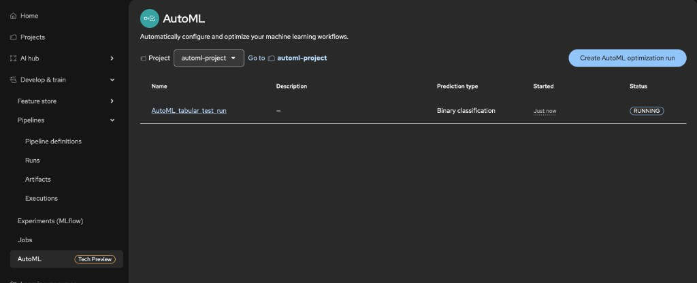
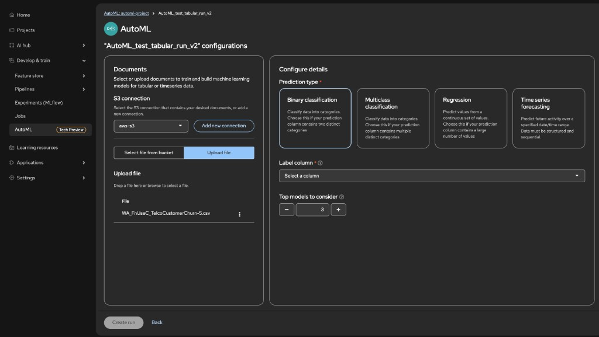
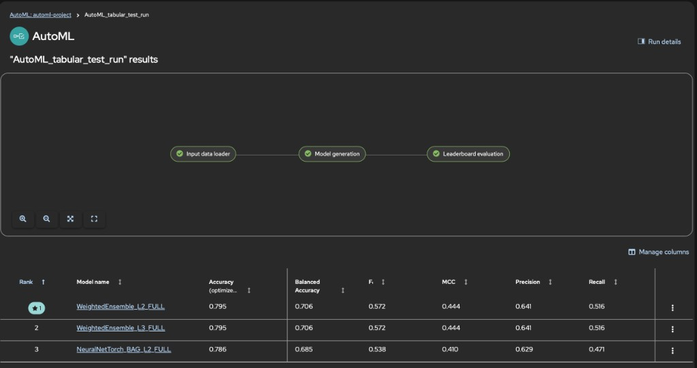
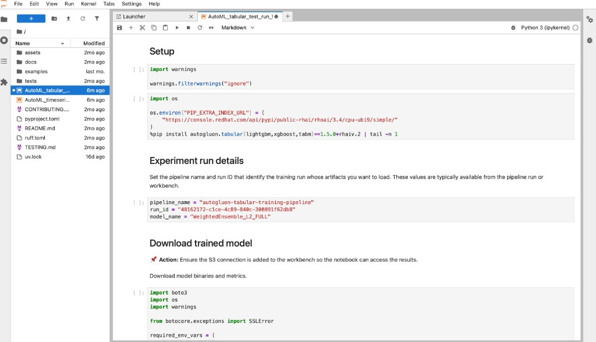

# 📚 Tutorial: Predict the Customer Churn

**Scenario:** You have (or download) the **Telco Customer Churn** dataset: one row per customer, with features like contract type, tenure, charges, and a **Churn** column (Yes/No). The goal is to train a model that predicts **Churn**, so you can identify at-risk customers and use the best model from the leaderboard for retention or deployment.

This tutorial walks you through that end-to-end in two ways:

1. **Option 1: AutoML UI (recommended):** create a project, S3 connections for **results** and **training data**, [Configure the Pipeline Server](#configure-the-pipeline-server) (one-time per project—AutoML optimization runs store artifacts through the pipeline backend), a workbench with the **results** connection attached, then run an **AutoML optimization** from **Develop & train** → **AutoML**. You can **optionally** copy the churn CSV into the training bucket first ([see below](#upload-the-training-dataset-to-s3)); otherwise, on the AutoML data step use **Upload file** to pass the same training file from your machine. After the run succeeds, view the leaderboard, use the predictor notebook, optionally register the model, deploy it with the AutoGluon serving runtime, and score the deployment.

2. **Option 2: KFP Native Pipeline Approach (advanced):** configure the Pipeline Server, import the compiled tabular AutoML pipeline YAML from [pipelines-components](https://github.com/red-hat-data-services/pipelines-components/blob/rhoai-3.4/pipelines/training/automl/autogluon_tabular_training_pipeline/pipeline.yaml) as a **Pipeline Definition**, and create a **pipeline run** with the same kind of parameters (S3 training data, label column, task type). Use this when you need the explicit pipeline graph, reproducible YAML, or your organization standardizes on Kubeflow pipelines.

The body of this document follows the **Option 1 (AutoML UI)** order. The **Option 2** pipeline flow is a single section at the end ([Run AutoML via pipeline definition](#optional-run-automl-via-pipeline-definition)).

## Table of contents

- [🏗️ Create a new project](#create-a-new-project)
- [💾 Create the S3 connections](#create-the-s3-connections)
- [⚙️ Configure the Pipeline Server](#configure-the-pipeline-server)
- [🔗 Create workbench with connections attached](#create-workbench-with-connections-attached)
- [⬆️ (Optional) Upload the training dataset to S3](#upload-the-training-dataset-to-s3)
- [🤖 Run AutoML with the AutoML UI](#run-automl-with-the-automl-ui)
- [📊 View the leaderboard](#view-the-leaderboard)
- [📓 Predictor Notebook](#predictor-notebook)
- [📚 Model Registry](#model-registry)
- [⚙️ Prepare the ServingRuntime for AutoGluon with KServe](#prepare-the-servingruntime-for-autogluon-with-kserve)
- [🚀 Model Deployment](#model-deployment)
- [🎯 Deployment Scoring](#deployment-scoring)
- [(Optional) Run AutoML via pipeline definition](#optional-run-automl-via-pipeline-definition)

<a id="create-a-new-project"></a>

## 🏗️ Create a new project

| Step | Action |
|------|--------|
| **①** | Log in to Red Hat OpenShift AI. |
| **②** | From the OpenShift AI dashboard, go to **Projects** and create a new project (for example, `customer-churn-ml`). |

<a id="create-the-s3-connections"></a>

## 💾 Create the S3 connections

Create two S3-compatible connections in your project: one for **results** and one for **training data** (the churn CSV). The **results** connection is the artifact store for AutoML: the leaderboard and trained model artifacts are written to the bucket configured for the Pipeline Server, whether you start the run from the AutoML UI or from a pipeline definition. Attach the **results** connection to the workbench in [Create workbench with connections attached](#create-workbench-with-connections-attached) so you can access artifacts without a restart. The **training data** connection is what you select in the AutoML UI (or what you pass as `train_data_secret_name` in an [optional pipeline run](#run-automl-with-the-required-inputs)).

**Results storage connection**

| Step | Action |
|------|--------|
| **①** | In your project, open the **Connections** tab and click **Create connection**. |
| **②** | Select **S3 compatible object storage - v1** as the connection type. |
| **③** | Enter a unique **Connection name** (for example, `automl-results-s3`). A resource name is generated automatically. |
| **④** | Fill in the connection details: **Endpoint** (S3-compatible bucket endpoint), **Bucket** (for pipeline results and Pipeline Server artifacts), **Region**, **Access key**, **Secret key**. |
| **⑤** | Click **Create**. |

Use this **results** connection when configuring the **Pipeline Server** (see [Configure the Pipeline Server](#configure-the-pipeline-server)). The bucket configured there is where AutoML artifacts are stored. For exact UI steps and endpoint formatting, see [Using connections](https://docs.redhat.com/en/documentation/red_hat_openshift_ai_self-managed/3.4/html/working_on_projects/using-connections_projects) and [Creating an S3 client](https://docs.redhat.com/en/documentation/red_hat_openshift_ai_self-managed/3.4/html/working_with_data_in_an_s3-compatible_object_store/creating-an-s3-client_s3) in the Red Hat OpenShift AI documentation.

**Training data connection**

| Step | Action |
|------|--------|
| **①** | In the same project, go to **Connections** and click **Create connection**. |
| **②** | Select **S3 compatible object storage - v1**. |
| **③** | Enter a unique **Connection name** (for example, `customer-churn-data-s3`) and complete **Endpoint**, **Bucket**, **Region**, **Access key**, **Secret key** for the bucket you will use for training data. |
| **④** | Click **Create**. Note the **Connection name**; you will select this connection in the AutoML UI for training data (or use it as `train_data_secret_name` in an [optional pipeline run](#run-automl-with-the-required-inputs)). |

<a id="configure-the-pipeline-server"></a>

## ⚙️ Configure the Pipeline Server

Configure the **Pipeline Server** for your project so that AutoML runs (and pipeline runs) can store artifacts (e.g. leaderboard, trained models) in your **results** S3 bucket. In Red Hat OpenShift AI, you do this from the project via the UI.

| Step | Action |
|------|--------|
| **①** | From the OpenShift AI dashboard, go to **Projects** and click the name of your project (e.g. `customer-churn-ml`). |
| **②** | Open the **Pipelines** tab (or the project details page where pipeline configuration is available). Click **Configure pipeline server**. |
| **③** | In the **Configure pipeline server** dialog, in the **Object storage connection** section, enter the same S3-compatible storage details as your **results** connection: **Bucket**, **Region**, **Endpoint**, **Access key**, and **Secret key**. Use the same values you used when creating the results S3 connection in [Create the S3 connections](#create-the-s3-connections). If the UI offers **Select existing connection**, you can choose your **results** S3 connection instead of re-entering the fields. |
| **④** | At the bottom you will find **Advanced Settings** URI, choose **Default database on the cluster** for development or testing, or **External MySQL database** if you have an external MySQL/MariaDB for production. |
| **⑤** | Click **Create** (or **Save**) to create or update the pipeline server. Wait until the Pipeline Server is ready. |

**Note:** For more details, see [Working with data science pipelines](https://docs.redhat.com/en/documentation/red_hat_openshift_ai_self-managed/3.4/html/working_with_ai_pipelines/index) in the Red Hat OpenShift AI documentation.

<a id="create-workbench-with-connections-attached"></a>

## 🔗 Create workbench with connections attached

| Step | Action |
|------|--------|
| **①** | In the project, go to **Workbenches** and create a **Workbench** (notebook environment). Choose an image and resource size as needed. |
| **②** | During workbench setup, use **Attach existing connections** to attach the **results** S3 connection you created above, so the workbench can access the results bucket (e.g. to download the leaderboard or artifacts later) without a restart. Only the **results** connection can be attached during workbench creation; the **training data** connection is used by the pipeline via run parameters when reading data from S3, not attached here. |
| **③** | Save and launch the workbench. For full steps, see [Creating a project and workbench](https://docs.redhat.com/en/documentation/red_hat_openshift_ai_self-managed/3.4/html/getting_started_with_red_hat_openshift_ai_self-managed/creating-a-workbench-select-ide_get-started) in the Red Hat OpenShift AI documentation. |

**Step ① — Choose workbench image and size:**


**Step ② — Attach existing connections:**


<a id="upload-the-training-dataset-to-s3"></a>

## ⬆️ (Optional) Upload the training dataset to S3

**When you can skip this:** If you use only the **AutoML UI**, you do **not** need to copy the CSV into the bucket first. On the data step of the wizard, choose **Upload file** and provide the training file from your computer—the same [WA_FnUseC_TelcoCustomerChurn.csv](data/churn/input_data/WA_FnUseC_TelcoCustomerChurn.csv) you can download from the `data` folder in this repository.

**When this step is useful:** Pre-upload the dataset if you prefer to **select a file from the bucket** in the AutoML UI, or if you need a stable object key for another workflow. If you use the [optional pipeline run](#run-automl-with-the-required-inputs), the pipeline reads training data from S3 by key—ensure the object exists at `train_data_file_key` (this upload step, or any equivalent upload/sync).

| Step | Action |
|------|--------|
| **①** | Download the Customer Churn dataset: [WA_FnUseC_TelcoCustomerChurn.csv](data/churn/input_data/WA_FnUseC_TelcoCustomerChurn.csv) (in the `data` folder in this repository). |
| **②** | Upload the file to the S3 bucket configured in the **training data** connection. Place it in a path you will use as the object key (for example, `data/WA_FnUseC_TelcoCustomerChurn.csv` or just `WA_FnUseC_TelcoCustomerChurn.csv`). |
| **③** | Note the **bucket name** and the **object key** (path) of the file. You will pick this file in the AutoML UI under **select a file from the bucket** (or use the same values as `train_data_bucket_name` and `train_data_file_key` if you use the [optional pipeline run](#run-automl-with-the-required-inputs)). |

<a id="run-automl-with-the-automl-ui"></a>

## 🤖 Run AutoML with the AutoML UI

**AutoML** in Red Hat OpenShift AI is available under **Develop & train** (it may show a **Tech Preview** badge). It walks you through naming the run, connecting training data from S3 or an upload, choosing the **prediction type** and **label** column, then creating the optimization run. For **Telco Customer Churn**, the target column is **Churn** (Yes/No), so the correct prediction type is **Binary classification**.

AutoML runs use the **Pipeline Server** to persist artifacts (leaderboard, models, notebooks). Complete [Configure the Pipeline Server](#configure-the-pipeline-server) in your project before you start if you have not already (one-time per project). If the UI prompts you during the wizard, use the same steps, then continue here.

| Step | Action |
|------|--------|
| **①** | In the left sidebar, open **Develop & train** → **AutoML**, then click **Create AutoML optimization run**. Ensure the **project** selector at the top matches the project you created (for example `customer-churn-ml`). |
| **②** | Enter a **name** for the experiment (or run), then click **Next**. |
| **③** | On the data step, choose an **S3 connection** where the training file will come from (use the **training data** connection from [Create the S3 connections](#create-the-s3-connections)). Either **Upload file** and pass the CSV from your machine (no prior upload required), or **select a file from the bucket** if you already placed the dataset there ([optional upload](#upload-the-training-dataset-to-s3)). |
| **④** | On the configuration screen, under **Configure details**, set **Prediction type** to **Binary classification** — churn is two classes (e.g. Yes/No). |
| **⑤** | Select the **label** column (also called **target** or **column to predict** in the UI): **Churn**. Complete any other required fields the wizard shows for your version (for example feature columns or validation options). |
| **⑥** | Click **Create run** (enabled once required fields, including the label column, are set). Wait until the run status shows **SUCCEEDED** on the AutoML list page. |

**Step ① — AutoML navigation and Create AutoML optimization run**



**Steps ③–⑥ — Training data, prediction type, label column, top models, and Create run**

Your UI may split **Documents** (data) and **Configure details** across steps or show them side by side. In the example below, the left **Documents** panel covers step **③**: pick the **training data** S3 connection and either **Upload file** or **Select file from bucket**. The right **Configure details** panel covers steps **④–⑤**: **Prediction type**, **Label column**, and **Top models to consider**.



Parameters on this screen (left **Documents**, right **Configure details**):

| UI control | What it does |
|------------|----------------|
| **S3 connection** | Select the **training data** connection you created in [Create the S3 connections](#create-the-s3-connections). Use **Add new connection** if you need another bucket profile. |
| **Select file from bucket** / **Upload file** | Either pick an object already in the bucket ([optional upload](#upload-the-training-dataset-to-s3)) or **Upload file** and choose the CSV from your machine (for example [WA_FnUseC_TelcoCustomerChurn.csv](data/churn/input_data/WA_FnUseC_TelcoCustomerChurn.csv)). |
| **Prediction type** (task cards) | Chooses the learning problem. **Binary classification** — two classes (e.g. Yes/No). **Multiclass classification** — more than two discrete classes. **Regression** — a numeric target. **Time series forecasting** — sequential data with a time axis. For **Telco Customer Churn**, use **Binary classification** because **Churn** has two values. |
| **Label column** | Required — the column to predict (the **target**). For this tutorial, select **Churn**. |
| **Top models to consider** | How many of the strongest candidate models AutoML advances for full refit and the leaderboard (use **−** / **+** to change the number). Range: `1–10`. A smaller value finishes sooner but explores fewer models; a larger value explores more at higher cost. |

After validating these fields, click **Create run** (step **⑥**) and wait for the flow graph steps to finish.

<a id="view-the-leaderboard"></a>

## 📊 View the leaderboard

When you follow [Run AutoML with the AutoML UI](#run-automl-with-the-automl-ui), the **leaderboard** (ranked models and metrics) **appears automatically** once your **optimization run** completes successfully—the UI updates when the run reaches **SUCCEEDED**. Stay in **Develop & train** → **AutoML**, open your completed run, and review the leaderboard there; you do not need **Pipelines** → **Runs** on this path.



<a id="predictor-notebook"></a>

## 📓 Predictor Notebook

The tabular AutoML training pipeline generates a **predictor notebook** (e.g. `automl_predictor_notebook.ipynb`) that loads and uses the selected AutoGluon predictor for predictions, evaluation, and exploration. How you **first obtain** that file depends on whether you use the AutoML UI or only artifacts/pipelines; after you have the `.ipynb`, the workflow is the same (upload into the workbench, run, customize).

For each refitted model, the predictor notebook is written to your **results** S3 bucket (the object store used for Pipeline Server run artifacts—same connection as in [Create the S3 connections](#create-the-s3-connections) and [Configure the Pipeline Server](#configure-the-pipeline-server)). Under that bucket, paths follow `models_artifact.path/model_name_FULL/notebooks`, where `models_artifact.path` looks like `autogluon-tabular-training-pipeline/<run_id>/autogluon-models-training/<task_id>/models_artifact/` (see the [autogluon_models_training component](https://github.com/red-hat-data-services/pipelines-components/tree/rhoai-3.4/components/training/automl/autogluon_models_training) for layout).

### Get the notebook — AutoML UI

When you trained from the [AutoML UI](#run-automl-with-the-automl-ui), open the completed run and its [leaderboard](#view-the-leaderboard). In the leaderboard table, locate the **model** you want. On that row, open the **⋮** menu (**three vertical dots**, right side of the row) and click **Save notebook** to download the predictor notebook to your machine.

### Get the notebook — artifacts / pipeline only

If you are not using the leaderboard menu above (for example you only follow the [pipeline run](#view-the-leaderboard-from-the-pipeline-run) path or copy files from storage), use the **Notebook** column on the leaderboard when present, or download from your artifact store (S3): paths follow `...<run_id>/autogluon-models-training/<task_id>/models_artifact/<model_name_FULL>/notebooks/automl_predictor_notebook.ipynb`. You can pull the file with the workbench’s S3 access from **Create workbench with connections attached** if that bucket is connected.

> [!tip]
> `run_id` can be found in **Develop & train** → **Pipelines** → **Runs** → your run → **Details**.

### Open and use the notebook in your workbench

| Step | Action |
|------|--------|
| **①** | Open your **workbench** (the notebook environment you created in **Create workbench with connections attached**). In JupyterLab, click the **Upload** button (upload icon) in the File Browser sidebar, select the downloaded `.ipynb` file, and upload it. The notebook appears in your workbench file tree. |
| **②** | Open the notebook and **run** it cell by cell. Ensure the workbench has access to the same S3 bucket (or the path configured in the notebook) so it can load the AutoGluon predictor and any data the notebook expects. If you attached the **results** connection when creating the workbench (see **Create workbench with connections attached**), that bucket is already available. |
| **③** | **Customize** if required: edit the model path or artifact location to point to a specific refitted model (e.g. `LightGBM_BAG_L1_FULL`), add cells for extra visualizations or metrics, change sample data, or adapt the notebook for your own workflows. Save the notebook in the workbench when done. |

For the notebook path and artifact layout per refitted model, see the [autogluon_models_training component](https://github.com/red-hat-data-services/pipelines-components/tree/rhoai-3.4/components/training/automl/autogluon_models_training). For the overall pipeline, see the [pipeline reference](https://github.com/red-hat-data-services/pipelines-components/tree/rhoai-3.4/pipelines/training/automl/autogluon_tabular_training_pipeline). For creating and importing notebooks in the workbench, see [Creating and importing notebooks](https://docs.redhat.com/en/documentation/red_hat_openshift_ai_self-managed/3.4/html/working_in_your_data_science_ide/working_in_jupyterlab#creating-and-importing-jupyter-notebooks_ide) in the Red Hat OpenShift AI documentation.

**Preview — predictor notebook in Workbench**



<a id="model-registry"></a>

## 📚 Model Registry

An **AutoML optimization run** (and the equivalent manual [pipeline run](#run-automl-with-the-required-inputs), which uses the same graph) executes the [autogluon-tabular-training-pipeline](https://github.com/red-hat-data-services/pipelines-components/blob/rhoai-3.4/pipelines/training/automl/autogluon_tabular_training_pipeline/pipeline.py) data science pipeline under the hood. That pipeline loads data from S3, splits it, runs **model selection** (top N on sampled data), then **refits** each top model on the full dataset via `autogluon_models_training`. Each refitted model is written as a **model artifact** with a `_FULL` suffix (e.g. `LightGBM_BAG_L1_FULL`, `WeightedEnsemble_L3_FULL`). The pipeline does **not** register models in Model Registry; it only produces the leaderboard and model artifacts in your pipeline artifact store (S3). To version and deploy a chosen model, you register it manually in **Red Hat OpenShift AI Model Registry** as described below.

**Creating a model registry (one-time, typically by an administrator)**

If your cluster does not yet have a model registry, an OpenShift AI administrator must create one and connect it to an external MySQL database.

| Step | Action |
|------|--------|
| **①** | From the OpenShift AI dashboard, go to **Settings** → **Model resources and operations** → **AI registry settings**. |
| **②** | Click **Create model registry**. In the dialog, enter a **Name** (and optionally a **Description**). Optionally edit the **Resource name** (must be lowercase alphanumeric with hyphens, max 253 characters). |
| **③** | In **Connect to external MySQL database**, enter **Host**, **Port**, **Username**, **Password**, and **Database**. Add a CA certificate if the database uses TLS. |
| **④** | Click **Create**. The new model registry appears on the AI registry settings page. |

> [!tip]
> You can also deploy a model from here; while doing so, the fields will already be filled.

**Step ② — Create model registry settings**


For full details and prerequisites (e.g. MySQL 5.x or 8.x), see [Creating a model registry](https://docs.redhat.com/en/documentation/red_hat_openshift_ai_cloud_service/1/html/managing_model_registries/creating-a-model-registry_managing-model-registries) in the Red Hat OpenShift AI documentation.

**Registering a refitted AutoGluon model from your AutoML or pipeline run**

The refit stage writes each top-N model to the pipeline workspace/artifact store (same layout whether you started the job from the AutoML UI or from an [optional pipeline run](#run-automl-with-the-required-inputs)). When registering, the **path** must target the **root folder of one refitted predictor** (the AutoGluon artifact for that `_FULL` model—often the folder named `predictor` under `.../models_artifact/<ModelName>_FULL/`). For many clusters that path lives in the **results** bucket from [Create the S3 connections](#create-the-s3-connections).

### Register model — AutoML UI (after an optimization run)

When your **optimization run** has finished and the [leaderboard](#view-the-leaderboard) is shown, pick the model row you want to register. Click the **⋮** menu (three vertical dots) on that row and choose **Register model**.

In the **Register model** dialog, select a **Model registry** (required). **Model name** and optional **Description** are typically pre-filled (you can edit them). **Model artifact location** is usually populated automatically with the S3 path where that refitted model is stored (often under `autogluon-tabular-training-pipeline/<run_id>/...`). Confirm the values, complete any other required fields your UI shows (for example **Version name** or **Source model format**, if present), then click **Register**.

### Register model — manually from AI Hub (or without the leaderboard shortcut)

If you do not use the leaderboard menu—for example you browse **AI Hub** → **Models** → **Registry** directly, or you only have artifact paths from a [pipeline run](#view-the-leaderboard-from-the-pipeline-run)—follow these steps:

| Step | Action |
|------|--------|
| **①** | From the OpenShift AI dashboard, go to **AI Hub** → **Models** → **Registry** and select your model registry. |
| **②** | Click **Register model**. In the **Register model** dialog, under **Model location**, select **Object storage** (S3-compatible). |
| **③** | Enter the S3 details for your pipeline artifact store: **Endpoint**, **Bucket**, **Region**, and **Path** to the **model root folder** of one refitted predictor (e.g. the folder `predictor` containing the `_FULL` model files for `LightGBM_BAG_L1_FULL/predictor` or `WeightedEnsemble_L3_FULL/predictor` from your run). You can get the path from the run’s **Artifacts** (inspect the refit task output) or from your artifact store layout. Alternatively, click **Autofill from connection** if you have a connection that can access that bucket and path. |
| **④** | Enter **Model name** and optional **Description**. Enter **Version name** and set **Source model format** (e.g. custom or the format your registry uses for AutoGluon). |
| **⑤** | Click **Register**. The model appears in the Model registry and can be used for versioning, promotion, and deployment (e.g. via the single-model serving platform). |

For the pipeline definition and artifact layout, see the [autogluon_tabular_training_pipeline](https://github.com/red-hat-data-services/pipelines-components/blob/rhoai-3.4/pipelines/training/automl/autogluon_tabular_training_pipeline/pipeline.py) (pipeline name: `autogluon-tabular-training-pipeline`). For more on working with model registries, see [Working with model registries](https://docs.redhat.com/en/documentation/red_hat_openshift_ai_self-managed/3.4/html/working_with_model_registries/working-with-model-registries_model-registry).

<a id="prepare-the-servingruntime-for-autogluon-with-kserve"></a>

## ⚙️ Prepare the ServingRuntime for AutoGluon with KServe

This section describes how to prepare a **Serving Runtime** on the cluster using KServe.

**Flow overview**

| Step | Action |
|------|--------|
| **①** | **Prepare ServingRuntime YAML**. |
| **②** | **Create the Serving Runtime** on the cluster. After this, the runtime is ready for [Model Deployment](#model-deployment). |

---

### Prepare [ServingRuntime YAML](serving/serving_runtime.yaml)

Create a YAML file for the KServe Serving Runtime. Set:

- `metadata.namespace` to your project name (e.g. `automl-project`).
You can also change:
- `metadata.annotations.openshift.io/display-name` to make name on UI more distinguishable

```yaml
apiVersion: serving.kserve.io/v1alpha1
kind: ServingRuntime
metadata:
  name: kserve-autogluonserver
  namespace: {NAMESPACE}
  annotations:
    openshift.io/display-name: "AutoGluon ServingRuntime for KServe"
spec:
  annotations:
    prometheus.kserve.io/port: "8080"
    prometheus.kserve.io/path: "/metrics"
  supportedModelFormats:
    - name: autogluon
      version: "1"
  protocolVersions:
    - v1
    - v2
  containers:
    - name: kserve-container
      image: registry.redhat.io/rhoai/odh-kserve-autogluon-server-rhel9@sha256:ea631abd80563c786637b7471bce8271c465e08b3b5921d29ad48d00c84215b9
      args:
        - --model_name={{.Name}}
        - --model_dir=/mnt/models
        - --http_port=8080
      securityContext:
        allowPrivilegeEscalation: false
        privileged: false
        runAsNonRoot: true
        capabilities:
          drop:
            - ALL
      resources:
        requests:
          cpu: "1"
          memory: 2Gi
        limits:
          cpu: "1"
          memory: 2Gi
```

Replace `{NAMESPACE}` with your project namespace.

### Create the Serving Runtime on OpenShift

| Step | Action |
|------|--------|
| **①** | Log in to the Red Hat OpenShift AI cluster. |
| **②** | In the left menu: **Settings** → **Model resources and operations** → **Serving runtimes** → **Add serving runtime** → **Upload files**. |
| **③** | Upload the ServingRuntime YAML you prepared (with `namespace` set for your scenario). |
| **④** | In **Select the API protocol this runtime supports**, choose **REST**. |
| **⑤** | In **Select the model types this runtime supports**, select **Predictive model**. |
| **⑥** | Click **Create**. |

**Steps ③–⑤ — REST protocol and Predictive model setup**


<a id="model-deployment"></a>

## 🚀 Model Deployment

After the [AutoGluon ServingRuntime](#prepare-the-servingruntime-for-autogluon-with-kserve) is created, deploy your AutoGluon model (e.g. from an AutoML run) so it is available for inference. This assumes the model is stored in S3.

| Step | Action |
|------|--------|
| **①** | In the left menu: **Projects** → ***Your Project*** → **Deployments** → **Deploy model**. |
| **②** | Under **Model location**, choose **S3 object storage**. |
| **③** | Create a new connection or use an existing one and fill in the S3 credentials and path to the model. |
| **④** | For **Model type**, choose **Predictive model**, click **Next**. |
| **⑤** | In **Model deployment name**, enter the model name under which the model should be available for inference. Use only lowercase letters, without spaces or special characters. |
| **⑥** | Under **Model framework**, select **autogluon - 1**. |
| **⑦** | Under **Serving runtime**, choose **Select from list…** → **AutoGluon ServingRuntime for KServe**, click **Next**. |
| **⑧** | You can configure **Advanced settings** to control access and reachability - for example, **Require token authentication** for secured access, or **Make model deployment available through an external route**, so you can call the model from outside the cluster (e.g. for scoring from your laptop or another service), click **Next**. |
| **⑨** | Review configuration and click **Deploy model**. |
| **⑩** | After the deployment is running, use the inference endpoint URL from the deployment details. See [Deployment Scoring](#deployment-scoring) for an example request. |

**Steps ②–④ — Model details**


**Steps ⑤–⑦ — Model deployment settings**


For more on serving and APIs, see [Deploying models on the model serving platform](https://docs.redhat.com/en/documentation/red_hat_openshift_ai_self-managed/3.4/html/deploying_models/deploying_models#deploying-models-on-the-model-serving-platform_rhoai-user).

<a id="deployment-scoring"></a>

## 🎯 Deployment Scoring

To score the deployed model from outside the cluster, use the **External** inference URL (ensure **Make model deployment available through an external route** is enabled in the deployment’s Advanced settings). In the deployment details, under **Inference endpoint**, copy the external URL and use it in your requests.

Example request (replace the placeholders and send a POST to your deployment’s inference (predict) endpoint):

- **`DEPLOYMENT_URL`** — The inference URL from the deployment details (base URL only; the path `/v1/models/<MODEL_NAME>:predict` is appended in the sample).
- **`MODEL_NAME`** — The resource name of the deployment (used in Kubernetes). Find it in **Deployment details** → **Model deployment** → **Resource name**.
- **`YOUR_TOKEN`** — The service account token, only if you enabled **Require token authentication** in Advanced settings. You can retrieve it, by going to **Projects** → ***Your Project*** → **Deployments**, then expanding your deployment and getting value of `Token secret` for available token. If you did not enable authentication, remove the `-H "Authorization: Bearer <YOUR_TOKEN>"` line from the command.

  ```bash
   curl -X POST \
   "<DEPLOYMENT_URL>/v1/models/<MODEL_NAME>:predict" \
   -H "Content-Type: application/json" \
   -H "Authorization: Bearer <YOUR_TOKEN>" \
   -d '{
     "instances": [
       {
         "gender": [1],
         "SeniorCitizen": [0],
         "Partner": [1],
         "Dependents": [0],
         "tenure": [12],
         "PhoneService": [1],
         "MultipleLines": ["No"],
         "InternetService": ["Fiber optic"],
         "OnlineSecurity": ["No"],
         "OnlineBackup": ["Yes"],
         "DeviceProtection": ["No"],
         "TechSupport": ["No"],
         "StreamingTV": ["Yes"],
         "StreamingMovies": ["No"],
         "Contract": ["Month-to-month"],
         "PaperlessBilling": [1],
         "PaymentMethod": ["Electronic check"],
         "MonthlyCharges": [70.35],
         "TotalCharges": [800.40]
       }
     ]
   }'
   ```

   Example response:

  ```json
  {
    "predictions": [
      "No"
    ]
  }
  ```

Reference for more info about v1 protocol: [KServe V1 Protocol](https://kserve.github.io/website/docs/concepts/architecture/data-plane/v1-protocol)

<a id="optional-run-automl-via-pipeline-definition"></a>

## (Optional) Run AutoML via pipeline definition

Use this path when you want a **Pipeline Definition** in the project, manual **Create run** with explicit parameters, or the same compiled YAML for `autogluon-tabular-training-pipeline` from [pipelines-components](https://github.com/red-hat-data-services/pipelines-components/blob/rhoai-3.4/pipelines/training/automl/autogluon_tabular_training_pipeline/pipeline.yaml) that the product’s AutoML feature may run under the hood. Complete the shared setup ([project](#create-a-new-project), [S3 connections](#create-the-s3-connections), [workbench](#create-workbench-with-connections-attached)). Ensure the training CSV exists in the **training data** bucket at the key you pass as `train_data_file_key`—for example by performing the [(optional) upload to S3](#upload-the-training-dataset-to-s3) or another upload method. Then perform the subsections below in order (through viewing the leaderboard from the pipeline run).

<a id="add-the-automl-pipeline-as-a-pipeline-definition"></a>

### 📋 Add the AutoML pipeline as a Pipeline Definition

| Step | Action |
|------|--------|
| **①** | Obtain the compiled YAML for `autogluon-tabular-training-pipeline` from [pipelines-components](https://github.com/red-hat-data-services/pipelines-components/blob/rhoai-3.4/pipelines/training/automl/autogluon_tabular_training_pipeline/pipeline.yaml). |
| **②** | In Red Hat OpenShift AI, go to **Pipelines** (or **Develop & train** → **Pipelines**) for your project. |
| **③** | Upload the compiled pipeline as a new **Pipeline Definition** (or create a pipeline from the YAML), following [Managing AI pipelines](https://docs.redhat.com/en/documentation/red_hat_openshift_ai_self-managed/3.4/html/working_with_ai_pipelines/managing-ai-pipelines_ai-pipelines). |

**Step ③ — Upload the compiled pipeline as a new Pipeline Definition**


<a id="run-automl-with-the-required-inputs"></a>

### ▶️ Run AutoML with the required inputs

| Step | Action |
|------|--------|
| **①** | From **Develop & train** → **Pipelines** → **Runs**, with your project selected, open the **Runs** tab and click **Create run** (or equivalent). |
| **②** | Set the **name** of the pipeline run and the run parameters: **train_data_secret_name** (the **Connection name** of the **training data** connection from [Create the S3 connections](#create-the-s3-connections)), **train_data_bucket_name** (bucket from that same connection), **train_data_file_key** (e.g. `data/WA_FnUseC_TelcoCustomerChurn.csv` or the object key where the CSV exists—after an [(optional) upload](#upload-the-training-dataset-to-s3) or any method that placed the file in that bucket), **label_column** `Churn`, **task_type** `binary`, **top_n** `3` (or another positive integer). If the UI asks for an experiment or run name, set them as run metadata. |
| **③** | Ensure the Pipeline Server is configured (see [Configure the Pipeline Server](#configure-the-pipeline-server)) with the **results** S3 connection, so artifacts are stored in the expected bucket. |
| **④** | Start the run and wait for it to complete. |

**Step ② — Set the pipeline run details**


<a id="view-the-leaderboard-from-the-pipeline-run"></a>

### 📊 View the leaderboard from the pipeline run

Use these steps after [Run AutoML with the required inputs](#run-automl-with-the-required-inputs) completes successfully. Here the optimization runs as a **data science pipeline**; the leaderboard HTML is an artifact on the run graph (unlike the [AutoML UI path](#view-the-leaderboard), where the leaderboard is shown automatically on the AutoML run screen).

| Step | Action |
|------|--------|
| **①** | Open the **completed pipeline run**: go to **Develop & train** → **Pipelines** → **Runs** and select the run for your optimization (the name may match the experiment or run name). If your UI links there from the AutoML run detail, you can use that shortcut instead. |
| **②** | In the **pipeline run graph**, click the last node named **`html_artifact`**. |
| **③** | In the node panel, preview the leaderboard by clicking **Artifact URI** (opens the HTML leaderboard so you can compare ranked models and metrics). |

**Pipeline path — Leaderboard via Artifact URI**


For exact artifact paths and layout, see the [autogluon_tabular_training_pipeline](https://github.com/red-hat-data-services/pipelines-components/blob/rhoai-3.4/pipelines/training/automl/autogluon_tabular_training_pipeline/pipeline.py) in the pipelines-components repository.
