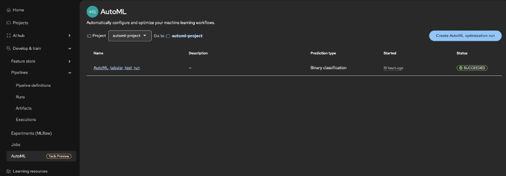
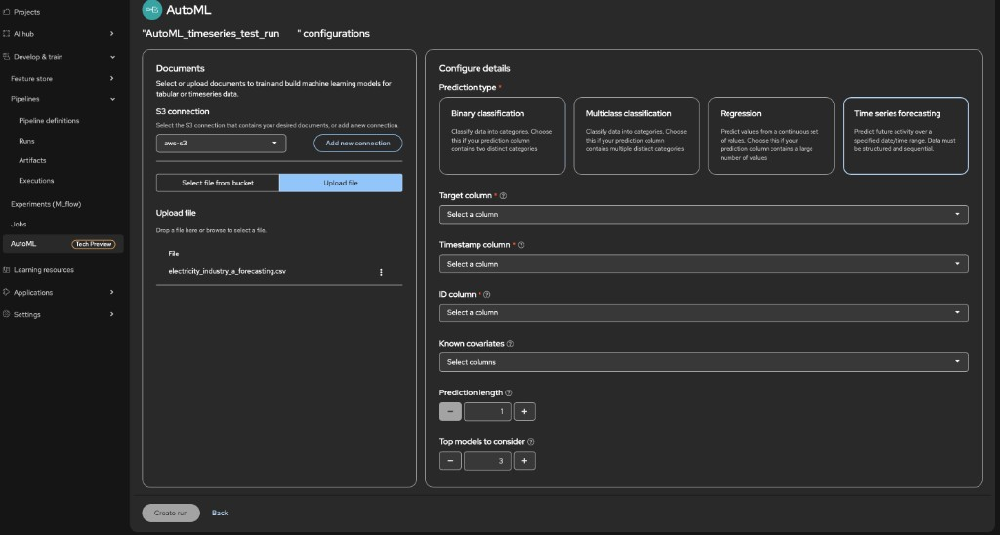
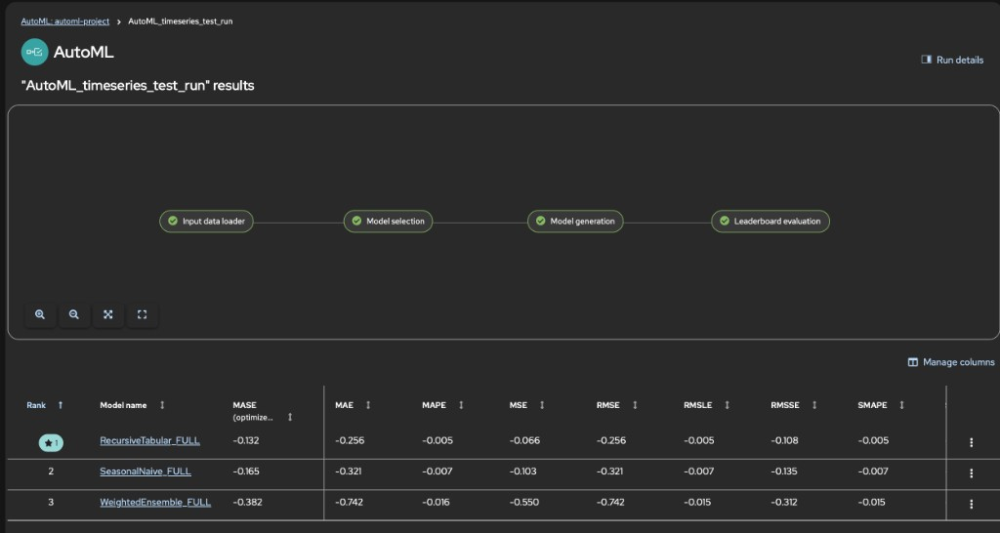

# 📚 Tutorial: Forecast with AutoML time series

**Scenario:** You want to **forecast electricity usage** for an industrial segment over time — a typical operations and capacity-planning use case. You will use **open, public sample data** from [IBM watsonx-ai-samples](https://github.com/IBM/watsonx-ai-samples/tree/master/cloud/data), run **AutoML** on Red Hat OpenShift AI, compare models on a leaderboard, and use the generated **time series predictor notebook** to explore forecasts.

Each row of the training file must include a **series identifier** (`item_id`), a **timestamp**, and a numeric **target** to forecast. Optional columns can be **known covariates** (known in advance for the forecast horizon). This tutorial’s primary dataset is a **single series** (one `item_id` for all rows).

This tutorial walks you through that end-to-end in two ways:

1. **Primary path — AutoML in the UI:** create a project, S3 connections for **results** and **training data**, a workbench with the **results** connection attached, then run an **AutoML optimization** from **Develop & train** → **AutoML**. You can **optionally** upload the time series CSV into the training bucket first ([see below](#upload-the-time-series-dataset-to-s3)); otherwise, on the AutoML data step use **Upload file** to pass the same file from your machine. Under **Configure details**, choose **Time series forecasting** and map **target**, **timestamp**, and **ID** columns. After the run succeeds, view the leaderboard, use the predictor notebook, optionally register the model, deploy it with the AutoGluon serving runtime, and score the deployment.
2. **Optional path — pipeline definition:** configure the Pipeline Server, import the compiled time series pipeline YAML from [pipelines-components](https://github.com/red-hat-data-services/pipelines-components/tree/rhoai-3.4/pipelines/training/automl/autogluon_timeseries_training_pipeline/pipeline.yaml), and create a **pipeline run** with time-series parameters (`id_column`, `timestamp_column`, `target`, `prediction_length`, `top_n`, and optional `known_covariates_names`). Use this when you need the explicit pipeline graph, reproducible YAML, or your organization standardizes on Kubeflow pipelines.

The body of this document follows the **primary (AutoML UI)** order. The [optional pipeline flow](#optional-run-timeseries-via-pipeline-definition) is a single section at the end.

**Pipeline reference (upstream):** [AutoGluon Time Series training pipeline](https://github.com/red-hat-data-services/pipelines-components/tree/rhoai-3.4/pipelines/training/automl/autogluon_timeseries_training_pipeline) — branch `rhoai-3.4`.

## Table of contents

- [📈 Use case and dataset](#use-case-and-dataset)
- [🏗️ Create a new project](#create-a-new-project)
- [💾 Create the S3 connections](#create-the-s3-connections)
- [⚙️ Configure the Pipeline Server](#configure-the-pipeline-server)
- [🔗 Create workbench with connections attached](#create-workbench-with-connections-attached)
- [⬆️ (Optional) Upload the time series dataset to S3](#upload-the-time-series-dataset-to-s3)
- [🤖 Run AutoML with the AutoML UI](#run-automl-with-the-automl-ui)
- [📊 View the leaderboard](#view-the-leaderboard)
- [📓 Time series predictor notebook](#time-series-predictor-notebook)
- [📚 Model Registry](#model-registry)
- [⚙️ Prepare the ServingRuntime for AutoGluon with KServe](#prepare-the-servingruntime-for-autogluon-with-kserve)
- [🚀 Model Deployment](#model-deployment)
- [🎯 Deployment Scoring](#deployment-scoring)
- [(Optional) Run time series AutoML via pipeline definition](#optional-run-timeseries-via-pipeline-definition)

<a id="use-case-and-dataset"></a>

## 📈 Use case and dataset

- **Use case:** **Industrial electricity demand forecasting** — predict future **industry A** usage from historical daily (or regular) readings, supporting planning and analytics workflows.
- **Public data:** [IBM watsonx-ai-samples](https://github.com/IBM/watsonx-ai-samples/tree/master/cloud/data) hosts sample datasets for watsonx tutorials. Under [cloud/data/electricity/](https://github.com/IBM/watsonx-ai-samples/tree/master/cloud/data/electricity), [electricity_usage.csv](https://github.com/IBM/watsonx-ai-samples/blob/master/cloud/data/electricity/electricity_usage.csv) provides `date` and `industry_a_usage` columns.
- **Pipeline / AutoML shape:** The time series flow expects `id_column`, `timestamp_column`, and `target` (and optional known covariates). The raw IBM file is **two columns only** (one implicit series).
- **File in this repo:** **[electricity_industry_a_forecasting.csv](data/timeseries/input_data/electricity_industry_a_forecasting.csv)** — preprocessed from the IBM file above: constant `item_id` = `industry_a`, `timestamp` (from `date`), `target` (from `industry_a_usage`). Use this file in the AutoML wizard or upload it to S3 for a pipeline run; or reproduce the same layout from the [raw CSV](https://raw.githubusercontent.com/IBM/watsonx-ai-samples/master/cloud/data/electricity/electricity_usage.csv) by adding an `item_id` column and renaming columns to match your chosen column mappings.

See also [data/timeseries/README.md](data/timeseries/README.md) for provenance and an optional **multi-series** sample ([timeseries_sales.csv](data/timeseries/input_data/timeseries_sales.csv)) with a `promo` covariate.

<a id="create-a-new-project"></a>

## 🏗️ Create a new project

| Step  | Action                                                                                                                    |
| ----- | ------------------------------------------------------------------------------------------------------------------------- |
| **①** | Log in to Red Hat OpenShift AI.                                                                                           |
| **②** | From the OpenShift AI dashboard, go to **Projects** and create a new project (for example, `automl-timeseries-forecast`). |

<a id="create-the-s3-connections"></a>

## 💾 Create the S3 connections

Create two S3-compatible connections in your project: one for **results** and one for **training data** (your time series CSV). The **results** connection is where AutoML run artifacts are stored (leaderboard, trained model artifacts, notebooks). Attach the **results** connection to the workbench in [Create workbench with connections attached](#create-workbench-with-connections-attached) so you can access artifacts without a restart. The **training data** connection is what you select in the AutoML UI (or what you pass as `train_data_secret_name` in an [optional pipeline run](#run-timeseries-pipeline-with-required-inputs)).

**Results storage connection**

| Step  | Action                                                                                                                |
| ----- | --------------------------------------------------------------------------------------------------------------------- |
| **①** | In your project, open the **Connections** tab and click **Create connection**.                                        |
| **②** | Select **S3 compatible object storage - v1** as the connection type.                                                  |
| **③** | Enter a unique **Connection name** (for example, `automl-ts-results-s3`). A resource name is generated automatically. |
| **④** | Fill in the connection details: **Endpoint**, **Bucket**, **Region**, **Access key**, **Secret key**.                 |
| **⑤** | Click **Create**.                                                                                                     |

Use this **results** connection when configuring the **Pipeline Server** (see [Configure the Pipeline Server](#configure-the-pipeline-server)) so artifacts are written to the expected bucket. For exact UI steps and endpoint formatting, see [Using connections](https://docs.redhat.com/en/documentation/red_hat_openshift_ai_self-managed/3.4/html/working_on_projects/using-connections_projects) and [Creating an S3 client](https://docs.redhat.com/en/documentation/red_hat_openshift_ai_self-managed/3.4/html/working_with_data_in_an_s3-compatible_object_store/creating-an-s3-client_s3) in the Red Hat OpenShift AI documentation.

**Training data connection**

| Step  | Action                                                                                                                                                                                                                                   |
| ----- | ---------------------------------------------------------------------------------------------------------------------------------------------------------------------------------------------------------------------------------------- |
| **①** | In the same project, go to **Connections** and click **Create connection**.                                                                                                                                                              |
| **②** | Select **S3 compatible object storage - v1**.                                                                                                                                                                                            |
| **③** | Enter a unique **Connection name** (for example, `automl-ts-data-s3`) and complete **Endpoint**, **Bucket**, **Region**, **Access key**, **Secret key** for the bucket that will hold training data.                                     |
| **④** | Click **Create**. Note the **Connection name**; you will select this connection in the AutoML UI for training data (or use it as `train_data_secret_name` in an [optional pipeline run](#run-timeseries-pipeline-with-required-inputs)). |

<a id="configure-the-pipeline-server"></a>

## ⚙️ Configure the Pipeline Server

Configure the **Pipeline Server** for your project so AutoML runs (and pipeline runs) can store artifacts in your **results** S3 bucket.

| Step  | Action                                                                                                                                    |
| ----- | ----------------------------------------------------------------------------------------------------------------------------------------- |
| **①** | Open **Projects** → your project → **Pipelines** → **Configure pipeline server**.                                                         |
| **②** | Under **Object storage connection**, use the same credentials as your **results** S3 connection (or select that connection if offered).   |
| **③** | **Advanced Settings** → database: **Default database on the cluster** for development, or **External MySQL** for production-style setups. |
| **④** | Save and wait until the Pipeline Server is ready.                                                                                         |

See [Working with data science pipelines](https://docs.redhat.com/en/documentation/red_hat_openshift_ai_self-managed/3.4/html/working_with_ai_pipelines/index).

<a id="create-workbench-with-connections-attached"></a>

## 🔗 Create workbench with connections attached

| Step  | Action                                                                                                                                                                                                                                                                                                                                                                                                                                              |
| ----- | --------------------------------------------------------------------------------------------------------------------------------------------------------------------------------------------------------------------------------------------------------------------------------------------------------------------------------------------------------------------------------------------------------------------------------------------------- |
| **①** | In the project, go to **Workbenches** and create a **Workbench** (notebook environment). Choose an image and resource size as needed.                                                                                                                                                                                                                                                                                                               |
| **②** | During workbench setup, use **Attach existing connections** to attach the **results** S3 connection you created above, so the workbench can access the results bucket (e.g. to download the leaderboard or artifacts later) without a restart. Only the **results** connection can be attached during workbench creation; the **training data** connection is used by the pipeline via run parameters when reading data from S3, not attached here. |
| **③** | Save and launch the workbench. For full steps, see [Creating a project and workbench](https://docs.redhat.com/en/documentation/red_hat_openshift_ai_self-managed/3.4/html/getting_started_with_red_hat_openshift_ai_self-managed/creating-a-workbench-select-ide_get-started) in the Red Hat OpenShift AI documentation.                                                                                                                            |

**Step ① — Choose workbench image and size:**


**Step ② — Attach existing connections:**


<a id="upload-the-time-series-dataset-to-s3"></a>

## ⬆️ (Optional) Upload the time series dataset to S3

**When you can skip this:** If you use only the **AutoML UI**, you do **not** need to copy the CSV into the bucket first. On the data step of the wizard, choose **Upload file** and provide [electricity_industry_a_forecasting.csv](data/timeseries/input_data/electricity_industry_a_forecasting.csv) (or your own file) from your computer.

**When this step is useful:** Pre-upload if you prefer **select a file from the bucket** in the AutoML UI, or if you run the [optional pipeline](#run-timeseries-pipeline-with-required-inputs), which reads training data from S3 by key—ensure the object exists at `train_data_file_key`.

| Step  | Action                                                                                                                                                                                                                                                                                       |
| ----- | -------------------------------------------------------------------------------------------------------------------------------------------------------------------------------------------------------------------------------------------------------------------------------------------- |
| **①** | Use the tutorial file [electricity_industry_a_forecasting.csv](data/timeseries/input_data/electricity_industry_a_forecasting.csv) (`item_id`, `timestamp`, `target`), or another CSV that matches your column plan (see [Use case and dataset](#use-case-and-dataset)).                      |
| **②** | Upload the file to the S3 bucket configured in the **training data** connection. Note the **object key** (e.g. `timeseries/input_data/electricity_industry_a_forecasting.csv`).                                                                                                              |
| **③** | Note the **bucket name** and **object key**. You will select this file in the AutoML UI under **select a file from the bucket**, or pass the same values as `train_data_bucket_name` and `train_data_file_key` in an [optional pipeline run](#run-timeseries-pipeline-with-required-inputs). |

**Optional — multi-series sample:** [timeseries_sales.csv](data/timeseries/input_data/timeseries_sales.csv) includes `promo` as a **known covariate**; see [data/timeseries/README.md](data/timeseries/README.md) and the optional pipeline parameters below.

<a id="run-automl-with-the-automl-ui"></a>

## 🤖 Run AutoML with the AutoML UI

**AutoML** is under **Develop & train**. You name the run, attach training data from S3 or **Upload file**, then under **Configure details** choose **Time series forecasting** and map **target**, **timestamp**, and **series ID** columns (plus optional covariates and horizon settings).

If this is your first time running AutoML in the project, you might be prompted to configure the **Pipeline Server**. If so, complete [Configure the Pipeline Server](#configure-the-pipeline-server) (one-time per project), then return here.

For the primary **[electricity_industry_a_forecasting.csv](data/timeseries/input_data/electricity_industry_a_forecasting.csv)** file, map **`target`** → column `target`, **`timestamp`** → `timestamp`, **ID** → `item_id`. Leave **Known covariates** empty for this file. Set **Prediction length** to an integer horizon (for example `7` or `14` days ahead). Set **Top models to consider** (or equivalent) as your cluster exposes—for example `3`.

| Step  | Action                                                                                                                                                                                                                                                                                                                                                                                                                                                                                                                                                             |
| ----- | ------------------------------------------------------------------------------------------------------------------------------------------------------------------------------------------------------------------------------------------------------------------------------------------------------------------------------------------------------------------------------------------------------------------------------------------------------------------------------------------------------------------------------------------------------------------ |
| **①** | Open **Develop & train** → **AutoML**, then click **Create AutoML optimization run**. Ensure the **project** selector matches your project (for example `automl-timeseries-forecast`).                                                                                                                                                                                                                                                                                                                                                                             |
| **②** | Enter a **name** for the experiment (or run), then click **Next**.                                                                                                                                                                                                                                                                                                                                                                                                                                                                                                 |
| **③** | On the data step, choose the **training data** [S3 connection](#create-the-s3-connections). Either **Upload file** and select the CSV from your machine, or **select a file from the bucket** if you [uploaded it](#upload-the-time-series-dataset-to-s3) earlier.                                                                                                                                                                                                                                                                                                 |
| **④** | Under **Configure details**, set **Prediction type** to **Time series forecasting** — *Predict future activity over a specified date/time range. Data must be structured and sequential.*                                                                                                                                                                                                                                                                                                                                                                          |
| **⑤** | Complete the time-series fields: **Target column** — the numeric column to forecast (`target` for the electricity sample). **Timestamp column** — time or date column (`timestamp`). **ID column** — series identifier (`item_id`; one value for the sample file). **Known covariates** — optional; omit or leave empty for the electricity file. **Prediction length** — forecast horizon in time steps (e.g. `7`). **Top models to consider** — e.g. `3`. Use the in-UI help icons next to fields if you need definitions. |
| **⑥** | Click **Create run** when required fields are valid. Wait until the run status is **SUCCEEDED** on the AutoML list page.                                                                                                                                                                                                                                                                                                                                                                                                                                           |

**Step ① — AutoML list and Create AutoML optimization run**

Open **Develop & train** → **AutoML**. Confirm the **Project** dropdown matches your tutorial project (for example `automl-timeseries-forecast`). Click **Create AutoML optimization run** to start the wizard.



**Steps ③–⑥ — Training data, time series prediction type, column mapping, and Create run**



| Parameter | What to set (primary file: [electricity_industry_a_forecasting.csv](data/timeseries/input_data/electricity_industry_a_forecasting.csv)) |
|-----------|---------------------------------------------------------------------------------------------------------------------------------------------|
| **S3 connection** | The **training data** [connection](#create-the-s3-connections) you created. **Add new connection** only if you need another bucket profile. |
| **Select file from bucket** / **Upload file** | [Pre-upload to S3](#upload-the-time-series-dataset-to-s3) and select the object, or **Upload file** and choose the CSV from your machine. |
| **Prediction type** | **Time series forecasting** (structured, sequential data; not Binary classification or Regression for this tutorial). |
| **Target column** | `target` — numeric value to forecast. |
| **Timestamp column** | `timestamp` — time index for each row. |
| **ID column** | `item_id` — separates multiple series in one table. |
| **Known covariates** | Leave empty for the electricity file. |
| **Prediction length** | Integer count of future steps (e.g. `7` or `14`); the UI may default to `1` — set a horizon that matches your use case. |
| **Top models to consider** | e.g. `3` — how many top models to refit and list; use **−** / **+** to change. Range: `1–7`. |

After validating these fields, click **Create run** (step **⑥**) and wait for the flow graph steps to finish.

<a id="view-the-leaderboard"></a>

## 📊 View the leaderboard

When you follow [Run AutoML with the AutoML UI](#run-automl-with-the-automl-ui), the **leaderboard** appears **automatically** once your **optimization run** completes successfully (**SUCCEEDED**). Stay in **Develop & train** → **AutoML**, open your completed run, and review the leaderboard there; you do not need **Pipelines** → **Runs** on this path.



If you train using a [pipeline definition](#optional-run-timeseries-via-pipeline-definition) instead, open the leaderboard from the completed pipeline run as described in [View the leaderboard from the pipeline run](#view-the-leaderboard-from-the-pipeline-run).

<a id="time-series-predictor-notebook"></a>

## 📓 Time series predictor notebook

Each refitted top model can emit a **time series predictor notebook** (e.g. `automl_predictor_notebook.ipynb`) that loads and uses the AutoGluon `TimeSeriesPredictor` for forecasts, evaluation, and exploration. You can download this notebook from the run artifacts, upload it to your workbench, run it, and customize it as needed.

For each refitted model, the predictor notebook is written to your **results** S3 bucket (the object store used for Pipeline Server run artifacts—same connection as in [Create the S3 connections](#create-the-s3-connections) and [Configure the Pipeline Server](#configure-the-pipeline-server)). Under that bucket, paths look like `autogluon-timeseries-training-pipeline/<run_id>/autogluon-timeseries-models-full-refit/<task_id>/model_artifact/<model_name_FULL>/notebooks/automl_predictor_notebook.ipynb` (see [autogluon_timeseries_models_full_refit](https://github.com/red-hat-data-services/pipelines-components/tree/rhoai-3.4/components/training/automl/autogluon_timeseries_models_full_refit)).

### Get the notebook — AutoML UI

After your optimization run succeeds, open the [leaderboard](#view-the-leaderboard). On the model row you want, open the **⋮** menu (**three vertical dots**) and choose **Save notebook** to download the `.ipynb`.

### Get the notebook — artifacts / pipeline only

If you do not use that menu, use the **Notebook** column on the leaderboard HTML when present, or download from S3 using paths under `.../model_artifact/<model_name_FULL>/notebooks/` (see [View the leaderboard from the pipeline run](#view-the-leaderboard-from-the-pipeline-run) if you only have pipeline artifacts).

> [!tip]
> `run_id` can be found in **Develop & train** → **Pipelines** → **Runs** → your run → **Details**.

### Open and use the notebook in your workbench

| Step  | Action                                                                                                                                                                                           |
| ----- | ------------------------------------------------------------------------------------------------------------------------------------------------------------------------------------------------ |
| **①** | Open your **workbench** from [Create workbench with connections attached](#create-workbench-with-connections-attached). In JupyterLab, **Upload** the downloaded `.ipynb` into the file browser. |
| **②** | Run the notebook cell by cell. Ensure access to the **results** bucket (or paths in the notebook); if you attached the **results** connection at workbench creation, that storage is available.  |
| **③** | **Customize** as needed: point to a specific refitted model (e.g. `WeightedEnsemble_FULL`), add plots or metrics, or adapt for your data.                                                        |

**Preview — time series predictor notebook in Workbench**


For importing notebooks, see [Creating and importing notebooks](https://docs.redhat.com/en/documentation/red_hat_openshift_ai_self-managed/3.4/html/working_in_your_data_science_ide/working_in_jupyterlab#creating-and-importing-jupyter-notebooks_ide).

<a id="model-registry"></a>

## 📚 Model Registry

An **AutoML optimization run** (and the equivalent [pipeline run](#run-timeseries-pipeline-with-required-inputs)) executes the [autogluon-timeseries-training-pipeline](https://github.com/red-hat-data-services/pipelines-components/blob/rhoai-3.4/pipelines/training/automl/autogluon_timeseries_training_pipeline/pipeline.py) data science pipeline. It performs model selection and **full refit** for top models and writes artifacts to your results storage; it does **not** auto-register models. Register manually in **Red Hat OpenShift AI Model Registry** when you want versioning or deployment.

Predictor paths for time series look like: `.../<run_id>/autogluon-timeseries-models-full-refit/<task_id>/model_artifact/<model_name_FULL>/predictor`. The leaderboard **Predictor** column lists paths you can copy.

### Creating a model registry (one-time, typically by an administrator)

If your cluster does not yet have a model registry, an OpenShift AI administrator must create one and connect it to an external MySQL database.

| Step  | Action |
| ----- | ------ |
| **①** | From the OpenShift AI dashboard, go to **Settings** → **Model resources and operations** → **AI registry settings**. |
| **②** | Click **Create model registry**. In the dialog, enter a **Name** (and optionally a **Description**). Optionally edit the **Resource name** (must be lowercase alphanumeric with hyphens, max 253 characters). |
| **③** | In **Connect to external MySQL database**, enter **Host**, **Port**, **Username**, **Password**, and **Database**. Add a CA certificate if the database uses TLS. |
| **④** | Click **Create**. The new model registry appears on the AI registry settings page. |

> [!tip]
> You can also deploy a model from here; while doing so, the fields will already be filled.

**Step ② — Create model registry settings**


For full details and prerequisites (e.g. MySQL 5.x or 8.x), see [Creating a model registry](https://docs.redhat.com/en/documentation/red_hat_openshift_ai_cloud_service/1/html/managing_model_registries/creating-a-model-registry_managing-model-registries) in the Red Hat OpenShift AI documentation.

### Registering a refitted AutoGluon time series model

When registering, the **path** must target the **predictor** root for one refitted `_FULL` model (often `.../model_artifact/<ModelName>_FULL/predictor`). For many setups this is in the **results** bucket from [Create the S3 connections](#create-the-s3-connections).

#### Register model — AutoML UI (after an optimization run)

When your **optimization run** has finished and the [leaderboard](#view-the-leaderboard) is shown, choose the model row you want to register. Click **⋮**, then **Register model**. In the dialog, select a **Model registry**, confirm **Model name**, **Description**, and **Model artifact location** (often pre-filled under `autogluon-timeseries-training-pipeline/<run_id>/...`). Complete remaining required fields, then **Register**.

#### Register model — manually from AI Hub (or without the leaderboard shortcut)

| Step  | Action                                                                                                                                                                                                                              |
| ----- | ----------------------------------------------------------------------------------------------------------------------------------------------------------------------------------------------------------------------------------- |
| **①** | Go to **AI Hub** → **Models** → **Registry** and select your registry.                                                                                                                                                              |
| **②** | Click **Register model** → **Model location** → **Object storage** (S3-compatible).                                                                                                                                                 |
| **③** | Enter **Endpoint**, **Bucket**, **Region**, and **Path** to the time-series **predictor** folder (e.g. `.../WeightedEnsemble_FULL/predictor`). Use **Autofill from connection** or paste from the leaderboard **Predictor** column. |
| **④** | Enter **Model name**, **Description**, **Version name**, **Source model format** as your environment requires.                                                                                                                      |
| **⑤** | Click **Register**.                                                                                                                                                                                                                 |

For more on registries, see [Working with model registries](https://docs.redhat.com/en/documentation/red_hat_openshift_ai_self-managed/3.4/html/working_with_model_registries/working-with-model-registries_model-registry).

<a id="prepare-the-servingruntime-for-autogluon-with-kserve"></a>

## ⚙️ Prepare the ServingRuntime for AutoGluon with KServe

Reuse the same KServe **ServingRuntime** YAML and UI steps as in the tabular tutorial (identical runtime for AutoGluon):

[Prepare the ServingRuntime for AutoGluon with KServe](churn_prediction_tutorial.md#prepare-the-servingruntime-for-autogluon-with-kserve).

<a id="model-deployment"></a>

## 🚀 Model Deployment

After the AutoGluon ServingRuntime exists, deploy from **Projects** → **Deployments** → **Deploy model**, or deploy a model registered in [Model Registry](#model-registry) via **AI Hub** → **Models** → **Registry** → **Actions** → **Deploy**. Choose **Predictive model**, framework **autogluon - 1**, runtime **AutoGluon ServingRuntime for KServe**. Configure routes and authentication as needed.

> **Custom id or timestamp column names**  
> Inference defaults to JSON keys **`item_id`** and **`timestamp`**. If your training data used different column names (for example `id_column` / `timestamp_column`), set these environment variables under **Advanced settings** → **Configuration parameters** (same values as in training):
>
> | Role | Default JSON key | Environment variable | Value |
> | --- | --- | --- | --- |
> | Series id | `item_id` | `AUTOGLUON_TS_ID_COLUMN` | Your `id_column` (e.g. `d_id`) |
> | Timestamp | `timestamp` | `AUTOGLUON_TS_TIMESTAMP_COLUMN` | Your `timestamp_column` (e.g. `date`) |
>
> No env vars are needed if your data already uses `item_id` and `timestamp`.

See [churn_prediction_tutorial.md — Model Deployment](churn_prediction_tutorial.md#model-deployment) for step-by-step screenshots if you deploy from S3 path directly.

<a id="deployment-scoring"></a>

## 🎯 Deployment Scoring

After deployment is running, call the inference endpoint from deployment details. Time-series requests can differ from tabular payloads, so validate the request shape with the generated predictor notebook and `TimeSeriesPredictor` examples. If your `id_column` / `timestamp_column` were not `item_id` / `timestamp`, configure the environment variables from [Model Deployment](#model-deployment) when you deploy.

Example request for this tutorial (**`item_id`**, **`timestamp`**, **`target`** in `instances`):

- **`DEPLOYMENT_URL`** — Base inference URL from deployment details (sample appends `/v1/models/<MODEL_NAME>:predict`).
- **`MODEL_NAME`** — Deployed model resource name.
- **`YOUR_TOKEN`** — Only if token authentication is enabled; otherwise omit the `Authorization` header.

```bash
   curl -X POST \
   "<DEPLOYMENT_URL>/v1/models/<MODEL_NAME>:predict" \
   -H "Content-Type: application/json" \
   -H "Authorization: Bearer <YOUR_TOKEN>" \
   -d '{
    "instances": [
        {
            "item_id": "industry_a",
            "timestamp": "2021-08-18",
            "target": 47.2642021
        },
        {
            "item_id": "industry_a",
            "timestamp": "2021-08-19",
            "target": 47.88765448
        },
        {
            "item_id": "industry_a",
            "timestamp": "2021-08-20",
            "target": 48.6093501
        },
        {
            "item_id": "industry_a",
            "timestamp": "2021-08-21",
            "target": 48.48047505
        },
        {
            "item_id": "industry_a",
            "timestamp": "2021-08-22",
            "target": 47.76307524
        }
    ]
   }'
```

Example response:

```json
{
   "predictions":[
      {
         "item_id":"industry_a",
         "timestamp":"2021-08-23T00:00:00",
         "mean":47.76307524,
         "0.1":46.993928415183454,
         "0.2":47.257960723421256,
         "0.3":47.44834659378267,
         "0.4":47.61102430019208,
         "0.5":47.76307524,
         "0.6":47.91512617980792,
         "0.7":48.07780388621733,
         "0.8":48.26818975657874,
         "0.9":48.532222064816544
      },
      {
         "item_id":"industry_a",
         "timestamp":"2021-08-24T00:00:00",
         "mean":47.76307524,
         "0.1":46.675337368888236,
         "0.2":47.04873544010281,
         "0.3":47.31798172005212,
         "0.4":47.54804273875206,
         "0.5":47.76307524,
         "0.6":47.97810774124794,
         "0.7":48.20816875994788,
         "0.8":48.47741503989719,
         "0.9":48.85081311111176
      },
      {
         "item_id":"industry_a",
         "timestamp":"2021-08-25T00:00:00",
         "mean":47.76307524,
         "0.1":46.43087386093746,
         "0.2":46.888191233645024,
         "0.3":47.217949234154204,
         "0.4":47.49971528691408,
         "0.5":47.76307524,
         "0.6":48.026435193085916,
         "0.7":48.308201245845794,
         "0.8":48.637959246354974,
         "0.9":49.09527661906254
      },
      {
         "item_id":"industry_a",
         "timestamp":"2021-08-26T00:00:00",
         "mean":47.76307524,
         "0.1":46.2247815903669,
         "0.2":46.75284620684251,
         "0.3":47.13361794756533,
         "0.4":47.45897336038416,
         "0.5":47.76307524,
         "0.6":48.06717711961584,
         "0.7":48.39253253243467,
         "0.8":48.773304273157486,
         "0.9":49.301368889633096
      },
      {
         "item_id":"industry_a",
         "timestamp":"2021-08-27T00:00:00",
         "mean":47.76307524,
         "0.1":46.04321065503208,
         "0.2":46.633604844507985,
         "0.3":47.059320592591554,
         "0.4":47.42307900254676,
         "0.5":47.76307524,
         "0.6":48.10307147745324,
         "0.7":48.466829887408444,
         "0.8":48.89254563549201,
         "0.9":49.48293982496792
      },
      {
         "item_id":"industry_a",
         "timestamp":"2021-08-28T00:00:00",
         "mean":47.76307524,
         "0.1":45.87905798191762,
         "0.2":46.52580241270948,
         "0.3":46.9921506493306,
         "0.4":47.39062802255995,
         "0.5":47.76307524,
         "0.6":48.13552245744005,
         "0.7":48.533999830669394,
         "0.8":49.00034806729052,
         "0.9":49.64709249808238
      },
      {
         "item_id":"industry_a",
         "timestamp":"2021-08-29T00:00:00",
         "mean":47.76307524,
         "0.1":45.72810401984045,
         "0.2":46.42666784552403,
         "0.3":46.9303815116409,
         "0.4":47.360786266654586,
         "0.5":47.76307524,
         "0.6":48.16536421334541,
         "0.7":48.595768968359096,
         "0.8":49.09948263447597,
         "0.9":49.79804646015955
      }
   ]
}
```

- **Notebook source:** use the model-specific notebook from [Time series predictor notebook](#time-series-predictor-notebook).
- **API/reference:** see [AutoGluon TimeSeries forecasting quickstart](https://auto.gluon.ai/stable/tutorials/timeseries/forecasting-quickstart.html) and [KServe V1 Protocol](https://kserve.github.io/website/docs/concepts/architecture/data-plane/v1-protocol).

<a id="optional-run-timeseries-via-pipeline-definition"></a>

## (Optional) Run time series AutoML via pipeline definition

Use this path for a **Pipeline Definition**, explicit **Create run** parameters, or the same YAML the product may run under the hood. Complete shared setup ([project](#create-a-new-project), [S3 connections](#create-the-s3-connections), [workbench](#create-workbench-with-connections-attached)). Ensure the training CSV exists at `train_data_file_key` when using S3 ([optional upload](#upload-the-time-series-dataset-to-s3) or sync). Then run the subsections below through [View the leaderboard from the pipeline run](#view-the-leaderboard-from-the-pipeline-run).

**Note:** The upstream pipeline uses a **12Gi workspace PVC** by default in `pipeline.py`; ensure your cluster can provision it.

<a id="add-the-time-series-automl-pipeline-as-a-pipeline-definition"></a>

### 📋 Add the time series AutoML pipeline as a Pipeline Definition

| Step  | Action                                                                                                                                                                                                                                                          |
| ----- | --------------------------------------------------------------------------------------------------------------------------------------------------------------------------------------------------------------------------------------------------------------- |
| **①** | Obtain the compiled YAML for `autogluon-timeseries-training-pipeline` from [pipelines-components](https://github.com/red-hat-data-services/pipelines-components/blob/rhoai-3.4/pipelines/training/automl/autogluon_timeseries_training_pipeline/pipeline.yaml). |
| **②** | In OpenShift AI: **Develop & train** → **Pipelines** for your project.                                                                                                                                                                                          |
| **③** | Upload as a **Pipeline Definition**, following [Managing AI pipelines](https://docs.redhat.com/en/documentation/red_hat_openshift_ai_self-managed/3.4/html/working_with_ai_pipelines/managing-ai-pipelines_ai-pipelines).                                       |

**Step ③ — Upload the compiled pipeline as a Pipeline Definition**


<a id="run-timeseries-pipeline-with-required-inputs"></a>

<a id="run-the-pipeline-with-required-inputs"></a>

### ▶️ Run the pipeline with required inputs

| Step  | Action                                                                                                                                                                                                        |
| ----- | ------------------------------------------------------------------------------------------------------------------------------------------------------------------------------------------------------------- |
| **①** | **Develop & train** → **Pipelines** → **Runs** → **Create run** for the time series definition.                                                                                                               |
| **②** | Set the run **name** and **parameters** using the tables below (the electricity example matches [electricity_industry_a_forecasting.csv](data/timeseries/input_data/electricity_industry_a_forecasting.csv)). |
| **③** | Ensure the **Pipeline Server** uses your **results** S3 connection.                                                                                                                                           |
| **④** | Start the run and wait until it completes.                                                                                                                                                                    |

**Pipeline parameters (electricity tutorial file):**

| Parameter                | Example                                                             |
| ------------------------ | ------------------------------------------------------------------- |
| `train_data_secret_name` | Training data connection name                                       |
| `train_data_bucket_name` | Bucket from that connection                                         |
| `train_data_file_key`    | e.g. `timeseries/input_data/electricity_industry_a_forecasting.csv` |
| `target`                 | `target`                                                            |
| `id_column`              | `item_id`                                                           |
| `timestamp_column`       | `timestamp`                                                         |
| `known_covariates_names` | Omit or empty — no covariates in this file                          |
| `prediction_length`      | `7` or `14`                                                         |
| `top_n`                  | `3`                                                                 |

**Example: [timeseries_sales.csv](data/timeseries/input_data/timeseries_sales.csv) with covariate**

| Parameter                | Example                                       |
| ------------------------ | --------------------------------------------- |
| `train_data_file_key`    | `timeseries/input_data/timeseries_sales.csv`  |
| `known_covariates_names` | `["promo"]` (often entered as JSON in the UI) |
| `prediction_length`      | `6` (must align with known future covariates) |

**Prediction with covariates:** If trained with `known_covariates_names`, forecasts need future covariate values over the horizon—provide them via the notebook or `TimeSeriesPredictor.predict`. See [forecasting quickstart](https://auto.gluon.ai/stable/tutorials/timeseries/forecasting-quickstart.html).

**Step ② — Set the pipeline run details**


<a id="view-the-leaderboard-from-the-pipeline-run"></a>

### 📊 View the leaderboard from the pipeline run

Use after [Run the pipeline with required inputs](#run-timeseries-pipeline-with-required-inputs) succeeds. Here the job runs as a **data science pipeline**; the leaderboard HTML is an artifact on the graph.

| Step  | Action                                                                      |
| ----- | --------------------------------------------------------------------------- |
| **①** | **Develop & train** → **Pipelines** → **Runs** → select your completed run. |
| **②** | In the **pipeline run graph**, open the last node named **`html_artifact`**. |
| **③** | Click **Artifact URI** in the panel to open the HTML leaderboard.           |

**Pipeline path — Leaderboard via Artifact URI**


For layout details, see [autogluon_timeseries_training_pipeline](https://github.com/red-hat-data-services/pipelines-components/blob/rhoai-3.4/pipelines/training/automl/autogluon_timeseries_training_pipeline/pipeline.py).

---

## Pipeline reference

- **Branch:** [rhoai-3.4](https://github.com/red-hat-data-services/pipelines-components/tree/rhoai-3.4) — [pipelines-components](https://github.com/red-hat-data-services/pipelines-components)
- **Pipeline:** [autogluon_timeseries_training_pipeline](https://github.com/red-hat-data-services/pipelines-components/tree/rhoai-3.4/pipelines/training/automl/autogluon_timeseries_training_pipeline) (name: `autogluon-timeseries-training-pipeline`)
- **Stability:** beta (see upstream README)
