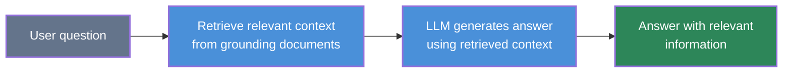
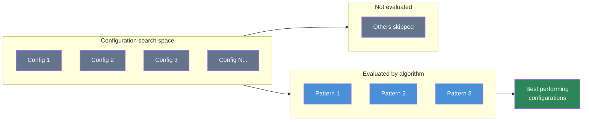

# AutoRAG

**AutoRAG** on Red Hat OpenShift AI lets you run and evaluate **Retrieval-Augmented Generation (RAG)** over your documents via the **Documents RAG Optimization Pipeline**. You provide documents and test questions in S3; the pipeline (orchestrated by Kubeflow Pipelines, using the [IBM ai4rag](https://github.com/IBM/ai4rag) optimization engine) runs against a **Llama-stack RAG server**, explores RAG configurations, and produces a **leaderboard** of RAG patterns plus artifacts (e.g. pattern configs, evaluation results, indexing and inference notebooks). See [Example scenarios](#example-scenarios) for a typical use case and a step-by-step tutorial.

## Status

**[Developer Preview](https://access.redhat.com/support/offerings/devpreview)** — This feature is not yet supported with Red Hat production service level agreements (SLAs) and may change. It provides early access for testing and feedback.

---

## Table of contents

- [Status](#status)
- [About AutoRAG](#about-autorag)
  - [What AutoRAG gives you](#what-autorag-gives-you)
  - [What AutoRAG supports](#what-autorag-supports)
  - [How it works under the hood](#how-it-works-under-the-hood)
  - [Pipeline flow](#pipeline-flow)
- [What you need to provide](#what-you-need-to-provide)
  - [Required](#required)
  - [Optional](#optional)
- [What you get from a run](#what-you-get-from-a-run)
- [Example scenarios](#example-scenarios)
- [Prerequisites](#prerequisites)
- [Running AutoRAG](#running-autorag)
- [Tutorial: Ask questions against Red Hat Summit 2026 schedule](red_hat_summit_tutorial.md)
- [References](#references)

---

## About AutoRAG

### What AutoRAG gives you

AutoRAG is **pipeline-driven**: you run the **Documents RAG Optimization Pipeline** on Red Hat OpenShift AI. The pipeline loads your documents and test data from S3, runs RAG configuration optimization (ai4rag) against a **Llama-stack RAG server**, and produces a leaderboard and RAG pattern artifacts.

- **Document-based Q&A** — Your documents (e.g., PDFs, MDs or text) are stored in S3. The pipeline loads them, extracts text, and uses them as the knowledge base for RAG optimization and evaluation.
- **Test data** — A `benchmark_data.json` file (in S3) defines the questions and expected answers used to evaluate RAG configurations.
- **RAG stack** — A **Llama-stack server** with the RAG stack (chat model, embedding model, vector store such as Milvus) is a prerequisite. See [Llama stack setup](https://github.com/red-hat-data-services/red-hat-ai-examples/blob/llama-stack_sample/examples/llama-stack/SETUP.md) for installation. The pipeline calls this stack for embedding, retrieval, and generation during optimization.
- **Leaderboard and artifacts** — When the pipeline run completes, you get an HTML leaderboard of RAG patterns ranked by your chosen metric, plus per-pattern artifacts (pattern.json, evaluation_results.json, indexing and inference notebooks) that you can use to deploy or refine your RAG application.

You can run AutoRAG via the **AutoRAG UI** (streamlined interface) or the **traditional Kubeflow Pipelines UI/API**; no custom training code is required.

### What AutoRAG supports

AutoRAG is exposed as the **Documents RAG Optimization Pipeline** (Kubeflow Pipelines), which uses the IBM ai4rag optimization engine against Red Hat OpenShift AI's Llama-stack RAG infrastructure.

| Area | Support |
|------|--------|
| **Documents** | Stored in S3-compatible object storage (via RHOAI Connections). |
| **Test data** | JSON file in S3 (e.g. `benchmark.json` or `benchmark_data.json`): list of items with `question`, `correct_answers`, and `correct_answer_document_ids` for evaluation. |
| **RAG stack** | Llama-stack server with RAG stack (chat model, embedding model, vector store e.g. Milvus). See [Llama stack setup](https://github.com/red-hat-data-services/red-hat-ai-examples/blob/llama-stack_sample/examples/llama-stack/SETUP.md). |
| **Execution** | **AutoRAG UI** (streamlined interface, recommended) or [Documents RAG Optimization Pipeline](https://github.com/red-hat-data-services/pipelines-components/blob/rhoai-3.4/pipelines/training/autorag/documents_rag_optimization_pipeline/pipeline.yaml) via Kubeflow Pipelines UI/API. |
| **What you get** | HTML leaderboard of RAG patterns, RAG pattern artifacts (pattern.json, evaluation results, indexing and inference notebooks). |

### How it works under the hood

The **Documents RAG Optimization Pipeline** runs on **Kubeflow Pipelines** and uses **RHOAI Connections** (S3 secrets) to read documents and test data from S3. It calls the **Llama-stack RAG server** (deployed as a prerequisite in your project; see [Llama stack setup](https://github.com/red-hat-data-services/red-hat-ai-examples/blob/llama-stack_sample/examples/llama-stack/SETUP.md)) for embeddings, retrieval, and LLM responses. The pipeline stages: load test data and input documents, sample and extract text (e.g. Docling), prepare the search space, run RAG templates optimization (ai4rag), evaluate patterns, and produce the leaderboard and RAG pattern artifacts.

**RAG interaction pattern** — User question → retrieve context from grounding documents → LLM generates answer with that context.

**Documents RAG optimization pipeline** — Kubeflow pipeline steps from the [documents RAG optimization pipeline](https://github.com/red-hat-data-services/pipelines-components/blob/rhoai-3.4/pipelines/training/autorag/documents_rag_optimization_pipeline/pipeline.yaml); see [Pipeline flow](#pipeline-flow) below for the stage list.

```mermaid
flowchart LR
    Start([Pipeline Start]) --> DataIngestion["Data Ingestion<br/>Load documents & test data"]
    DataIngestion --> DocProcessing["Documents Discovery</br> & text extraction"]
    DocProcessing --> SearchSpace["Search Space Definition<br/>Define configurations & validate models"]
    SearchSpace --> OptLoop{"Optimization<br/>Loop"}
    OptLoop --> SelectConfig["Select Configuration<br/>GAM prediction"]
    SelectConfig --> ExecuteRAG["Execute RAG Pipeline<br/>Run configuration"]
    ExecuteRAG --> Evaluate["Evaluate Performance<br/>Test data metrics"]
    Evaluate --> UpdateLeaderboard["Artifacts storage<br/>RAG Pattern"]
    UpdateLeaderboard --> CheckMax{"Reached max<br/>patterns?"}
    CheckMax -->|No| OptLoop
    CheckMax -->|Yes| ResultsStorage["Artifacts Storage<br/>Leaderboard & logs"]
    ResultsStorage --> End([Pipeline Complete])
    style Start fill:#2d8659,color:#fff,stroke-width:2px
    style End fill:#2d8659,color:#fff,stroke-width:2px
    style OptLoop fill:#d97706,color:#fff,stroke-width:2px
    style CheckMax fill:#d97706,color:#fff,stroke-width:2px
    style DataIngestion fill:#4a90d9,color:#fff,stroke-width:2px
    style DocProcessing fill:#4a90d9,color:#fff,stroke-width:2px
    style SearchSpace fill:#4a90d9,color:#fff,stroke-width:2px
    style SelectConfig fill:#4a90d9,color:#fff,stroke-width:2px
    style ExecuteRAG fill:#4a90d9,color:#fff,stroke-width:2px
    style Evaluate fill:#4a90d9,color:#fff,stroke-width:2px
    style UpdateLeaderboard fill:#4a90d9,color:#fff,stroke-width:2px
    style ResultsStorage fill:#4a90d9,color:#fff,stroke-width:2px
```

**RAG configuration optimization** — The optimizer chooses which subset of the configuration search space to evaluate (e.g. 16 candidate patterns); it ranks evaluated patterns and tags the top performers (e.g. top 3) as best, and skips the rest to avoid full grid search.

### Pipeline flow

The [Documents RAG Optimization Pipeline](https://github.com/red-hat-data-services/pipelines-components/blob/rhoai-3.4/pipelines/training/autorag/documents_rag_optimization_pipeline/pipeline.yaml) uses the [IBM ai4rag](https://github.com/IBM/ai4rag) optimization engine. In that flow:

1. **Documents discovery** — Lists available documents from S3, performs sampling if applied and writes a JSON manifest as `documents_descriptor.json` file with metadata.
2. **Test data loading** — Loads test data (questions, expected answers) based on `documents_descriptor.json` file.
3. **Text extraction** — Extracts text from sampled documents (e.g. using Docling).
4. **Search space preparation** — Builds the search space of RAG configurations (foundation models, embedding models, etc.) to try.
5. **RAG templates optimization** — Systematically tests configurations using GAM-based prediction and produces RAG patterns, metrics, and notebooks.
6. **Evaluation & leaderboard** — Evaluates each pattern on the test data and builds an HTML leaderboard ranked by the chosen metric (e.g. faithfulness, answer_correctness, context_correctness).

You provide pipeline parameters (S3 locations, Llama-stack secret name, embedding/generation model lists, optimization metric); the pipeline produces the leaderboard and RAG pattern artifacts in the run's artifact store.

---

## What you need to provide

To run the Documents RAG Optimization Pipeline, you provide:

### Required

| Item | Description |
|------|-------------|
| **Documents** | Your source documents (e.g. Red Hat Summit schedule, one file per this event day) uploaded to an S3-compatible bucket. You can find this schedule at [Red Hat Summit 2026](https://events.experiences.redhat.com/widget/redhat/sum26/SessionCatalog2026?tab.day=20260511). The pipeline ingests them for RAG optimization. |
| **Test data** | A benchmark JSON file in S3 (e.g. `benchmark_data.json` or `test_data.json`). Format: a list of objects with `question`, `correct_answers` (list of strings), and `correct_answer_document_ids` (list of document IDs that should contain the answer). Document metadata in the extracted corpus must include `document_id` matching these IDs. |
| **S3 connections** | RHOAI Connections for: (1) pipeline results/artifacts (used by the Pipeline Server), (2) one connection for both test data and input documents (same bucket, different object keys/paths). Use the same connection name for `test_data_secret_name` and `input_data_secret_name` in the pipeline run. |
| **Llama-stack secret** | A Kubernetes secret (or connection) containing `LLAMA_STACK_CLIENT_BASE_URL` and `LLAMA_STACK_CLIENT_API_KEY` for the Llama-stack RAG server. See [Llama stack setup](https://github.com/red-hat-data-services/red-hat-ai-examples/blob/llama-stack_sample/examples/llama-stack/SETUP.md). The pipeline references it as `llama_stack_secret_name`. |
| **RAG stack** | A Llama-stack server with the RAG stack enabled (chat model, embedding model, vector store such as Milvus), deployed in the project. See [Llama stack setup](https://github.com/red-hat-data-services/red-hat-ai-examples/blob/llama-stack_sample/examples/llama-stack/SETUP.md). |

### Optional

| Item | Description |
|------|-------------|
| **Pipeline parameters** | `embeddings_models` (list of embedding model IDs), `generation_models` (list of foundation model IDs), `optimization_metric` (e.g. `faithfulness`, `answer_correctness`, `context_correctness`), `llama_stack_vector_database_id` (e.g. `ls_milvus`). See the [pipeline README](https://github.com/red-hat-data-services/pipelines-components/tree/rhoai-3.4/pipelines/training/autorag/documents_rag_optimization_pipeline) for full input/output descriptions. |

---

## What you get from a run

When the Documents RAG Optimization Pipeline run completes, you get:

- **Leaderboard** — HTML file ranking RAG patterns by the optimization metric (e.g. faithfulness, answer_correctness, context_correctness). Use it to compare and choose the best RAG configuration.
- **RAG pattern artifacts** — For each top-N pattern: **pattern.json** (settings and scores), **evaluation_results.json** (per-question evaluation), **indexing.ipynb** (to build/populate the vector index), and **inference.ipynb** (for retrieval and generation). Use these to deploy or refine your RAG application.
- **Other artifacts** — Sampled documents metadata and extracted text (markdown) from the pipeline stages.

Artifacts are stored in the artifact store configured for your run (e.g. S3 via your Pipeline Server). Open the run's **Artifacts** in the Pipelines UI to download the leaderboard and RAG pattern outputs.

---

## Example scenarios

AutoRAG is aimed at **document Q&A and evaluation**: you have a set of documents (e.g. policies, manuals, contracts) and a list of questions with expected answers; you run the **Documents RAG Optimization Pipeline** to find the best RAG configuration and then use the generated artifacts (leaderboard, inference notebooks) to power search, chatbots, or internal tools.

In each scenario you run the same pipeline; only the document set and test data change.

| Scenario | Your data | What you do | Outcome |
|----------|-----------|-------------|---------|
| **Compliance and policy Q&A** | Policy documents, standards, handbooks (MD/text) in S3; benchmark JSON with questions and expected answers (e.g. "What is the approval process for X?", "Which policy covers Y?") | Upload docs and benchmark to S3; run the pipeline; evaluate patterns by faithfulness and answer correctness | Leaderboard of RAG patterns; deploy the best pattern so HR, legal, or compliance can query policies with traceable, cited answers. |
| **Technical support knowledge base** | Product documentation, runbooks, KB articles in S3; benchmark with common support questions and known-good answers | Run the pipeline; compare retrieval and generation quality across patterns | Best RAG configuration for support chatbots, agent-facing search, or self-service portals; use inference notebooks to embed Q&A in your tooling. |
| **Contract and procurement review** | Contracts, RFPs, vendor documentation in S3; benchmark with clause-level Q&As (obligations, deadlines, terms) | Run the pipeline with your document set and test questions; pick metric (e.g. context_correctness, faithfulness) | Ranked leaderboard; legal or procurement teams use the best-pattern indexing + inference notebooks for contract search and clause lookup. |
| **Financial and investor reporting** | Quarterly reports, earnings materials, investor decks in S3; benchmark with questions and expected answers (sample data in `data/rh_summit_2026/`: [input_data/](data/rh_summit_2026/input_data/) and [benchmark_data.json](data/rh_summit_2026/benchmark_data.json), sourced from [Red Hat Summit 2026](https://events.experiences.redhat.com/widget/redhat/sum26/SessionCatalog2026?tab.day=20260511)) | Upload to S3; run the pipeline against the Llama-stack RAG server | Leaderboard and RAG pattern artifacts; finance or IR teams use the best-pattern inference notebook for report Q&A. |

**Try it with sample data:** Follow the [Tutorial: Ask questions against Red Hat Summit 2026](red_hat_summit_tutorial.md). Use the data in `data/rh_summit_2026/` ([input_data/](data/rh_summit_2026/input_data/) and [benchmark_data.json](data/rh_summit_2026/benchmark_data.json); documents are sourced from [Red Hat Summit 2026](https://events.experiences.redhat.com/widget/redhat/sum26/SessionCatalog2026?tab.day=20260511)). Upload to S3, ensure the [Llama stack is set up](https://github.com/red-hat-data-services/red-hat-ai-examples/blob/llama-stack_sample/examples/llama-stack/SETUP.md) and the RAG stack is ready, add and run the Documents RAG Optimization Pipeline, then view the leaderboard and RAG pattern artifacts.

---

## Prerequisites

- **Red Hat OpenShift AI** installed and accessible, with **Kubeflow Pipelines** available.
- A **data science project** and a **Pipeline Server** configured with object storage for runs and artifacts.
- **Llama-stack server with RAG stack** — Deploy and configure a Llama-stack server in the project with the RAG stack (chat model, embedding model, and vector store such as Milvus). Follow [Llama stack setup](https://github.com/red-hat-data-services/red-hat-ai-examples/blob/llama-stack_sample/examples/llama-stack/SETUP.md). The pipeline will use this server for retrieval and generation. See also [Deploying a RAG stack in a project](https://docs.redhat.com/en/documentation/red_hat_openshift_ai_self-managed/3.0/html/working_with_llama_stack/deploying-a-rag-stack-in-a-project_rag) and [Build AI/Agentic Applications with Llama Stack](https://docs.redhat.com/en/documentation/red_hat_openshift_ai_self-managed/3.2/html-single/working_with_llama_stack/working_with_llama_stack).
- **S3 connections** (RHOAI Connections) for: (1) pipeline results/artifacts (Pipeline Server), (2) one connection for test data and input documents (same bucket, different keys/paths).
- **Llama-stack secret** — A secret (or connection) with `LLAMA_STACK_CLIENT_BASE_URL` and `LLAMA_STACK_CLIENT_API_KEY` for the pipeline to call the RAG server.

---

## Running AutoRAG

You can run AutoRAG using **two approaches**:

### Option 1: AutoRAG UI (Recommended)

Use the streamlined **AutoRAG UI** in Red Hat OpenShift AI:

1. Ensure the **Llama-stack RAG stack** is deployed (see [Llama stack setup](https://github.com/red-hat-data-services/red-hat-ai-examples/blob/llama-stack_sample/examples/llama-stack/SETUP.md)) and that you have created a connection with `LLAMA_STACK_CLIENT_BASE_URL` and `LLAMA_STACK_CLIENT_API_KEY`.
2. Ensure the **sample documents** from [data/rh_summit_2026/input_data/](data/rh_summit_2026/input_data/) and the **benchmark** file [benchmark_data.json](data/rh_summit_2026/benchmark_data.json) are uploaded to S3 (same bucket, different paths), and that you have S3 connections configured.
3. Navigate to **AutoRAG** in the Red Hat OpenShift AI sidebar (under **Models**).
4. **Create a new AutoRAG optimization run**: configure basic settings (name, description, Llama Stack connection), then set up knowledge base (data connections, vector DB provider, evaluation queries, optimization metric) and model configuration (embedding models, generation models).
5. **View the results**: Once the run completes, access the leaderboard and RAG pattern artifacts.

### Option 2: KFP Native Pipeline

Use the traditional **Kubeflow Pipelines** approach for advanced use cases or automation:

1. Ensure the **Llama-stack RAG stack** is deployed and you have created a secret (or connection) with `LLAMA_STACK_CLIENT_BASE_URL` and `LLAMA_STACK_CLIENT_API_KEY`.
2. Ensure the **sample documents** and **benchmark** file are uploaded to S3, and that you have S3 connections configured plus a Pipeline Server configured with a results connection for artifacts.
3. Add the **Documents RAG Optimization Pipeline** as a Pipeline Definition (from [pipelines-components](https://github.com/red-hat-data-services/pipelines-components/tree/rhoai-3.4/pipelines/training/autorag/documents_rag_optimization_pipeline), branch `rhoai-3.4`). You can find its compiled version [here](https://github.com/red-hat-data-services/pipelines-components/blob/rhoai-3.4/pipelines/training/autorag/documents_rag_optimization_pipeline/pipeline.yaml).
4. Create a pipeline run and set the required parameters: use the same connection and bucket for test data and input documents (different object keys); Llama-stack secret name; embeddings_models and generation_models lists; optimization_metric.
5. **View the results** in the run's Artifacts: leaderboard HTML and RAG pattern artifacts.

For a detailed step-by-step walkthrough of both approaches, see the [Tutorial: Ask questions against Red Hat Summit 2026](red_hat_summit_tutorial.md).

## Tutorial: Ask questions against Red Hat Summit 2026

**Scenario:** You use the **sample data** in `data/rh_summit_2026/`: **input documents** (Red Hat Summit 2026) in `input_data/` and **benchmark_data.json** with questions (sourced from [Red Hat Summit 2026](https://events.experiences.redhat.com/widget/redhat/sum26/SessionCatalog2026?tab.day=20260511)). The goal is to run the **Documents RAG Optimization Pipeline** on Red Hat OpenShift AI against a **Llama-stack RAG server**, then view the leaderboard and RAG pattern artifacts (configs, evaluation results, indexing and inference notebooks).

**Step-by-step guide:** The full tutorial walks you through creating a project, deploying the Llama-stack server with the RAG stack, creating S3 and Llama-stack connections, uploading documents and test data to S3, adding the Documents RAG Optimization Pipeline as a Pipeline Definition, running the pipeline with the required parameters, and viewing the leaderboard and RAG pattern artifacts. Follow the tutorial here: **[Red Hat Summit 2026 tutorial](red_hat_summit_tutorial.md)**.

---

## References

- [Documents RAG Optimization Pipeline](https://github.com/red-hat-data-services/pipelines-components/tree/rhoai-3.4/pipelines/training/autorag/documents_rag_optimization_pipeline) — Pipeline definition, inputs, outputs, and artifact layout (branch `rhoai-3.4`)
- [Llama stack setup](https://github.com/red-hat-data-services/red-hat-ai-examples/blob/llama-stack_sample/examples/llama-stack/SETUP.md) — Installation and configuration for the Llama-stack RAG server (prerequisite for AutoRAG)
- [IBM ai4rag](https://github.com/IBM/ai4rag) — RAG templates and optimization engine used by the pipeline
- [Deploying a RAG stack in a project (Red Hat OpenShift AI)](https://docs.redhat.com/en/documentation/red_hat_openshift_ai_self-managed/3.0/html/working_with_llama_stack/deploying-a-rag-stack-in-a-project_rag)
- [Build AI/Agentic Applications with Llama Stack (Red Hat OpenShift AI)](https://docs.redhat.com/en/documentation/red_hat_openshift_ai_self-managed/3.2/html-single/working_with_llama_stack/working_with_llama_stack)
- [Managing AI pipelines (Red Hat OpenShift AI)](https://docs.redhat.com/en/documentation/red_hat_openshift_ai_self-managed/3.2/html/working_with_ai_pipelines/managing-ai-pipelines_ai-pipelines)
- [Using connections (Red Hat OpenShift AI)](https://docs.redhat.com/en/documentation/red_hat_openshift_ai_self-managed/2.22/html/working_on_data_science_projects/using-connections_projects)
