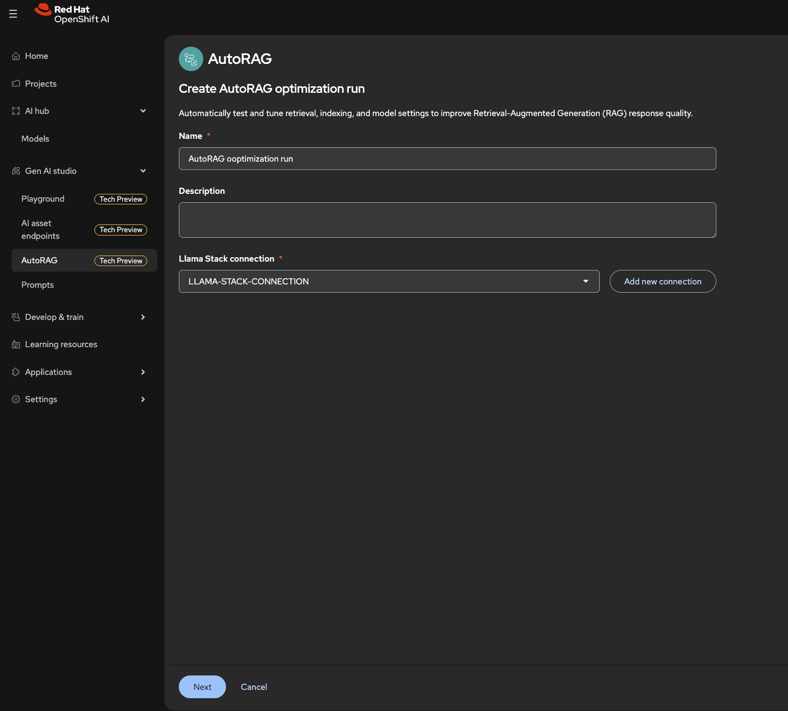
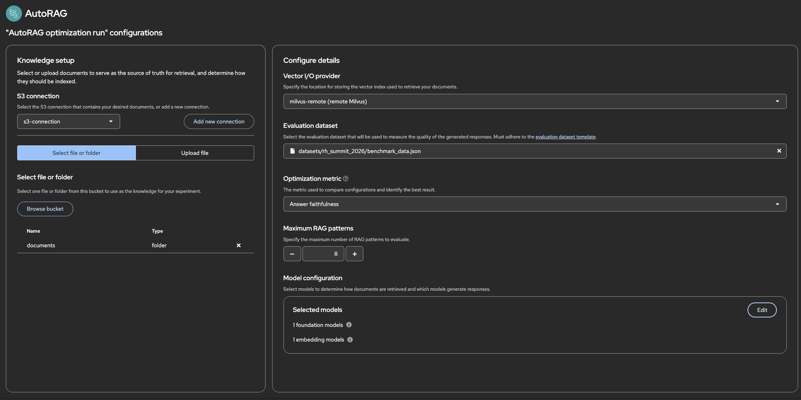
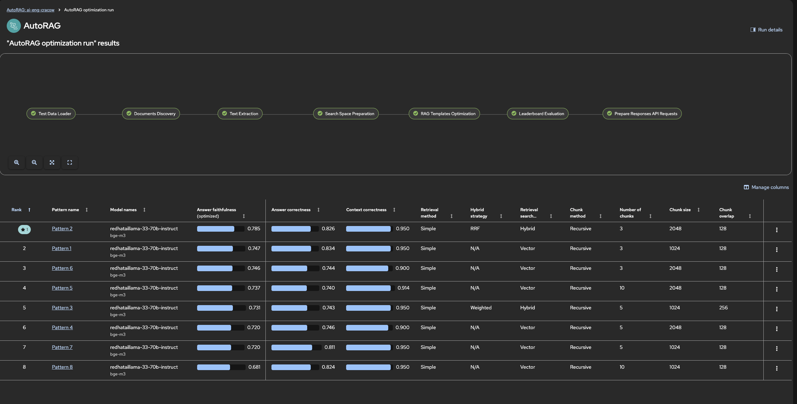
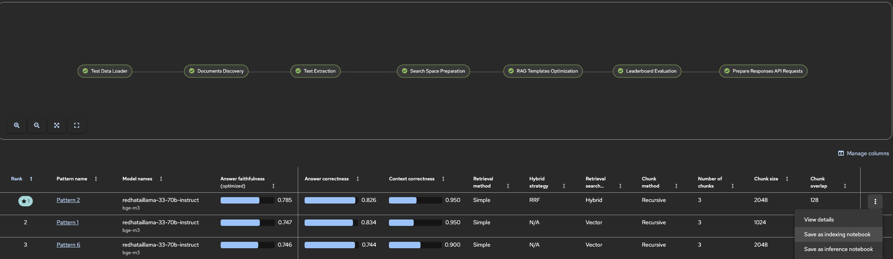

# 📚 Tutorial: Ask questions against Red Hat Summit 2026 schedule

**Scenario:** You use the **sample data** provided in this repository under `data/rh_summit_2026/`: **input documents** (Red Hat Summit 2026 schedule) in `input_data/` and **benchmark_data.json** (questions and expected answers) in the same folder. These documents are sourced from [Red Hat Summit 2026](https://events.experiences.redhat.com/widget/redhat/sum26/SessionCatalog2026?tab.day=20260511). The goal is to run the **Documents RAG Optimization Pipeline** on Red Hat OpenShift AI: upload the provided data to S3, run the pipeline against a **Llama-stack RAG server**, and get a **leaderboard** of RAG patterns plus artifacts (e.g. pattern configs, evaluation results, indexing and inference notebooks) for production RAG.

This tutorial walks you through: creating a project, creating S3 connections for pipeline results and for test/data, ensuring the [Llama stack is set up](https://github.com/red-hat-data-services/red-hat-ai-examples/blob/llama-stack_sample/examples/llama-stack/SETUP.md) and the RAG stack is deployed, adding the `documents_rag_optimization_pipeline` as a Pipeline Definition, running the pipeline with the required parameters, and viewing the leaderboard and RAG pattern artifacts.

## Table of contents

- [🏗️ Create a project](#create-a-project)
- [🚀 Deploy Llama-stack server with RAG stack](#deploy-llama-stack-server-with-rag-stack)
- [🔑 Create Llama-stack connection (secret)](#create-llama-stack-connection-secret)
- [💾 Create S3 connections](#create-s3-connections)
- [🔗 Create workbench with connections attached](#create-workbench-with-connections-attached)
- [⬆️ Upload documents and test data to S3](#upload-documents-and-test-data-to-s3)
- [📋 Create AutoRAG run](#add-the-documents-rag-optimization-pipeline)
- [▶️ Run the pipeline with required inputs](#run-the-pipeline-with-required-inputs)
- [📊 View the leaderboard and RAG patterns](#view-the-leaderboard-and-rag-patterns)
- [📓 Work with the best RAG pattern notebooks](#work-with-the-best-rag-pattern-notebooks)

## 🏗️ Create a project

| Step | Action |
|------|--------|
| **①** | Log in to Red Hat OpenShift AI. |
| **②** | Go to **Data science projects** and create a new project (e.g. `red-hat-summit-rag`). |
| **③** | Configure a **Pipeline Server** for the project with object storage for runs and artifacts (you will use the results S3 connection from [Create S3 connections](#create-s3-connections) when configuring the Pipeline Server). For full steps, see [Creating a project and workbench](https://docs.redhat.com/en/documentation/red_hat_openshift_ai_self-managed/2.8/html/getting_started_with_red_hat_openshift_ai_self-managed/creating-a-project-workbench_get-started) and pipeline runtime configuration in the Red Hat OpenShift AI documentation. |

## 🚀 Deploy Llama-stack server with RAG stack

| Step | Action |
|------|--------|
| **①** | In the project, deploy a **Llama-stack server** with the **RAG stack** enabled (chat model, embedding model, vector store such as Milvus). Follow [Llama stack setup](https://github.com/red-hat-data-services/red-hat-ai-examples/blob/llama-stack_sample/examples/llama-stack/SETUP.md) for installation and configuration; see also [Deploying a RAG stack in a project](https://docs.redhat.com/en/documentation/red_hat_openshift_ai_self-managed/3.0/html/working_with_llama_stack/deploying-a-rag-stack-in-a-project_rag). |

**Note:** You will need the **RAG/API base URL** and any **API key** for the Llama-stack connection (secret) used by the pipeline (see next section).

## 🔑 Create Llama-stack connection (secret)

The pipeline expects a Kubernetes secret containing the Llama-stack client URL and API key. Use a two-step approach: (1) create a new connection type that defines the required properties, then (2) create a connection of that type in your project.

| Step | Action |
|------|--------|
| **①** | **Create a new connection type.** Go to **Settings** → **Environment Setup** → **Connection types** and click **Create connection type**. Define the required properties for Llama-stack: **LLAMA_STACK_CLIENT_BASE_URL** and **LLAMA_STACK_CLIENT_API_KEY**. This one-time setup is typically done by an administrator (or by you, if you have permissions). Once created, the Llama-stack connection type is available when creating connections in projects. |
| **②** | **Create a connection of that type in the project.** In your project, open **Connections** and create a new connection. Select the **Llama-stack** connection type you defined in step ①. Enter **LLAMA_STACK_CLIENT_BASE_URL** (the base URL of your Llama-stack RAG server) and **LLAMA_STACK_CLIENT_API_KEY** (if your deployment requires it). The pipeline references this connection’s secret by name as `llama_stack_secret_name`. |

**① Create new `LLAMA_STACK_CONNECTION` connection type for Llama Stack server**

**② Create new connection of type `LLAMA_STACK_CONNECTION` inside your project**

**Note:** Use the connection’s **resource name** (or secret name) as `llama_stack_secret_name` when creating the pipeline run. For exact key names and options, see the [documents_rag_optimization_pipeline](https://github.com/red-hat-data-services/pipelines-components/tree/rhoai-3.4/pipelines/training/autorag/documents_rag_optimization_pipeline) README.

## 💾 Create S3 connections

Create S3-compatible connections so the pipeline can read test data and input documents, and so the Pipeline Server can store run artifacts (leaderboard, RAG patterns).

**Results storage (Pipeline Server artifacts)**

| Step | Action |
|------|--------|
| **①** | In your project, open **Connections** and create an **S3 compatible object storage** connection to a bucket you will use for **pipeline results and artifacts** (leaderboard, RAG patterns, etc.). |
| **②** | Use this connection when configuring the **Pipeline Server** for the project so that pipeline runs and artifacts are stored in this bucket. |

**Test data and input documents (single connection)**

| Step | Action |
|------|--------|
| **①** | Create one **S3 compatible object storage** connection pointing to the bucket (and credentials) where you store both the **benchmark file** (`data/rh_summit_2026/benchmark_data.json`) and the **input documents** (`data/rh_summit_2026/input_data/`). Alternatively you can upload them during knowledge base configuration. The connection must expose credentials that include `AWS_ACCESS_KEY_ID`, `AWS_SECRET_ACCESS_KEY`, `AWS_S3_ENDPOINT`, `AWS_DEFAULT_REGION`, and `AWS_S3_BUCKET`  (or equivalent) as expected by the AutoRAG. |

**Note:** Use the same **Connection name** for both `test_data_secret_name` and `input_data_secret_name` in the pipeline run. Use the same **bucket name** for both `test_data_bucket_name` and `input_data_bucket_name`; set `test_data_key` to the path of the benchmark file and `input_data_key` to the path (prefix) of the input documents.

## 🔗 Create workbench with connections attached

| Step | Action |
|------|--------|
| **①** | In the project, go to **Workbenches** and create a **Workbench** (notebook environment). Choose an image and resource size as needed. |
| **②** | During workbench setup, use **Attach existing connections** to attach the **Llama-stack** connection (from [Create Llama-stack connection](#create-llama-stack-connection-secret)) and the **S3 data** connection (from [Create S3 connections](#create-s3-connections)) used for test data and input documents. |
| **③** | Save and launch the workbench. For full steps, see [Creating a project and workbench](https://docs.redhat.com/en/documentation/red_hat_openshift_ai_self-managed/2.8/html/getting_started_with_red_hat_openshift_ai_self-managed/creating-a-workbench-select-ide_get-started) in the Red Hat OpenShift AI documentation. |

**Step ① — Choose workbench image and size:**

**Step ② — Attach Llama Stack Server API key and base URL as env variables:**

**Step ③ — Start the workbench**

## ⬆️ Upload documents and test data to S3

Sample data is provided in this repository under **`data/rh_summit_2026/`**: input documents (MDs) in [data/rh_summit_2026/input_data/](data/rh_summit_2026/input_data/) and the benchmark file [data/rh_summit_2026/benchmark_data.json](data/rh_summit_2026/benchmark_data.json). The documents are created based on [Red Hat Summit 2026](https://events.experiences.redhat.com/widget/redhat/sum26/SessionCatalog2026?tab.day=20260511) schedule.

| Step | Action |
|------|--------|
| **①** | Upload the **input documents** from [data/rh_summit_2026/input_data/](data/rh_summit_2026/input_data/) to your S3 data bucket attached with **workbench** created in the previous step. Place the MDs in a path you will use as the object key or prefix (e.g. `documents/` or `input_data/`). Note the **bucket name** and **object key** (path or prefix) for `input_data_bucket_name` and `input_data_key`. |
| **②** | Upload **[benchmark_data.json](data/rh_summit_2026/benchmark_data.json)** from `data/rh_summit_2026/` to the **same** S3 bucket, in a different path (e.g. `data/rh_summit_2026/benchmark_data.json` or `benchmark_data.json`). Note the **object key** (path) for `test_data_key`; use the same bucket name for `test_data_bucket_name`. |

**Example data layout inside S3 storage**

## 📋 Create AutoRAG run

You can create an AutoRAG optimization run using two approaches: the **AutoRAG UI** (streamlined interface) or the **KFP native pipeline** approach (traditional pipeline upload).

### Option 1: AutoRAG UI (Recommended)

Red Hat OpenShift AI provides a streamlined UI for creating AutoRAG optimization runs. This interface automatically tests and tunes retrieval, indexing, and model settings to improve RAG response quality.

| Step | Action |
|------|--------|
| **①** | In Red Hat OpenShift AI, navigate to **AutoRAG** from the left sidebar (under **Models**). Click to create a new **AutoRAG optimization run**. |
| **②** | **Configure basic settings:** Enter a **Name** for your run (e.g., "AutoRAG optimization run") and optionally a **Description**. Select your **Llama Stack connection** from the dropdown (the connection you created in [Create Llama-stack connection](#create-llama-stack-connection-secret)). |
| **③** | **Set up knowledge base and configuration:** Configure the **Knowledge setup** with your data connections (S3 connections for test data and input documents from [Create S3 connections](#create-s3-connections)). Select the **Vector DB provider** (e.g., `milvus`), configure **Evaluation queries** (your benchmark data), set the **Optimization metric** (e.g., `faithfulness`, `answer_correctness`, or `context_correctness`), and configure **Resource GPU settings** if needed. In the **Model configuration** section, select your **embedding models** and **generation models** to evaluate. |
| **④** | Click **Next** to review your configuration and **Create** the run. The system will automatically execute the optimization pipeline, testing different combinations of retrieval, indexing, and model settings. In the end it generates the results table for each optimization run. |
| **⑤** | You can download the indexing and inference notebook for each generated RAG pattern. |

**Step ① & ② — Create AutoRAG run with basic configuration:**

**Step ③ — Configure knowledge base, models, and optimization settings:**

**Step ④ — View AutoRAG optimization runs:**

**Step ⑤ — Download the results:**

### Option 2: KFP Native Pipeline Approach

For advanced users or automation scenarios, you can use the traditional Kubeflow Pipelines (KFP) approach:

| Step | Action |
|------|--------|
| **①** | Get the compiled **Documents RAG Optimization Pipeline** from [here](https://github.com/red-hat-data-services/pipelines-components/blob/rhoai-3.4/pipelines/training/autorag/documents_rag_optimization_pipeline/pipeline.yaml) and download it. |
| **②** | In Red Hat OpenShift AI, go to **Pipelines** (or **Develop & Train** → **Pipelines**) for your project and upload the compiled pipeline in YAML format. |

**Pipeline creation:**

## ▶️ Run the pipeline with required inputs

| Step | Action |
|------|--------|
| **①** | From **Pipelines**, create a new pipeline run using **Pipeline definitions → ⋮ → Create run** for the Documents RAG Optimization Pipeline you added. |
| **②** | Set the **Name** of the run and the following run parameters (see the [pipeline README](https://github.com/red-hat-data-services/pipelines-components/tree/rhoai-3.4/pipelines/training/autorag/documents_rag_optimization_pipeline) for full descriptions): **test_data_secret_name** and **input_data_secret_name** (same connection name from the single S3 data connection), **test_data_bucket_name** and **input_data_bucket_name** (same bucket), **test_data_key** (path to the benchmark file, e.g. `benchmark_data.json`), **input_data_key** (path to documents folder or prefix, e.g. `input_data/`), **llama_stack_secret_name** (secret with `LLAMA_STACK_CLIENT_BASE_URL` and `LLAMA_STACK_CLIENT_API_KEY`), **embeddings_models** (list of embedding model identifiers to try, e.g. `["ibm/slate-125m-english-rtrvr-v2", "intfloat/multilingual-e5-large"]`), **generation_models** (list of foundation/generation model identifiers, e.g. `["mistralai/mixtral-8x7b-instruct-v01", "ibm/granite-13b-instruct-v2"]`), **optimization_metric** (e.g. `faithfulness`, `answer_correctness`, or `context_correctness`; default `faithfulness`).   **Set `llama_stack_vector_database_id` (e.g. `ls_milvus`; default is `ls_milvus`) and please note that only `inline::milvus` provider type is currently supported**. |
| **③** | Ensure the **Pipeline Server** is configured with the results S3 connection from [Create S3 connections](#create-s3-connections), so artifacts are stored in the expected bucket. |
| **④** | Start the run via **Create run** and wait for it to complete. |

**Step ① Create new pipeline run:**

**Step ② & ③ Fill up pipeline parameters and run the pipeline:**

**Step ④ Wait for the pipeline to finish:**

## 📊 View the leaderboard and RAG patterns

| Step | Action |
|------|--------|
| **①** | Open the run details and go to **Artifacts** (or the artifact store configured for the run). |
| **②** | Locate the **leaderboard** artifact (e.g. HTML from the leaderboard evaluation task). Download or open it to see RAG patterns ranked by the optimization metric. |
| **③** | Locate the **rag_patterns_artifact** (or equivalent output). Each top-N RAG pattern includes: **pattern.json** (settings and scores), **evaluation_results.json** (per-question evaluation), **indexing.ipynb** (to build/populate the vector index), and **inference.ipynb** (for retrieval and generation). Use these to deploy or refine your RAG application. |

**Step ① Open:**

**Step ② Review the leaderboard results:**

For exact artifact paths and layout, see the [documents_rag_optimization_pipeline](https://github.com/red-hat-data-services/pipelines-components/tree/rhoai-3.4/pipelines/training/autorag/documents_rag_optimization_pipeline) README (Outputs and "Files stored in user storage" sections).

**Step 3 Locate best pattern directory inside your S3 storage (pattern 8 in this case) and review the generated files:**

## 📓 Work with the best RAG pattern notebooks

Each RAG pattern in the **rag_patterns_artifact** includes two generated notebooks that you can use to run the optimized RAG configuration: one for **index building** and one for **retrieval and generation**. Use the **inference notebook** to ask questions against your RAG system. This section describes how to work with these notebooks for the **best** (top-ranked) pattern from the leaderboard.

**Notebooks per pattern:**

| Notebook | Purpose |
|----------|---------|
| **indexing.ipynb** | Builds or populates the vector index/collection for the RAG pattern. Run this first when you need to (re)index your documents into the vector store (e.g. Milvus) used by the pattern. |
| **inference.ipynb** | Performs retrieval and generation: you ask questions and the notebook retrieves relevant context from the indexed documents and generates answers using the RAG pattern. **Use this notebook to ask questions against the RAG system.** |

| Step | Action |
|------|--------|
| **①** | From the [leaderboard](#view-the-leaderboard-and-rag-patterns), identify the **best-ranked** RAG pattern (e.g. the top row). Note the pattern name (e.g. `pattern1`, `pattern2`) — it corresponds to a subfolder in the **rag_patterns_artifact**. |
| **②** | In the run **Artifacts**, open the **rag_patterns_artifact** and go to the subfolder for that pattern (e.g. `rag_patterns_artifact/pattern1/`). Download **indexing.ipynb** and **inference.ipynb** (and **pattern.json** if you need the full config). You can download the whole pattern folder from the artifact store (e.g. via the Pipelines UI or from S3 if your workbench has the results connection attached). |
| **③** | Open your **workbench** (from [Create workbench with connections attached](#create-workbench-with-connections-attached)). Ensure the workbench has access to the Llama-stack RAG server (same endpoint and credentials the pipeline used) and to any data paths the notebooks expect. Upload **indexing.ipynb** and **inference.ipynb** into the workbench (e.g. via JupyterLab **Upload** in the file browser). |
| **④** | **Run the indexing notebook first** (if the vector index for this pattern is not already populated). Open **indexing.ipynb**, set any required config (e.g. document path, vector store connection, collection name — the notebook may read defaults from **pattern.json**). Run the cells to build or populate the vector index. This step is required so that the RAG system has documents to retrieve from when you ask questions. |
| **⑤** | **Run the inference notebook to ask questions.** Open **inference.ipynb**, run the setup cells (e.g. connect to the Llama-stack RAG server, load the pattern config). Then use the notebook to **ask questions** against your RAG system: the notebook will retrieve relevant chunks from the index and generate answers using the pattern’s retrieval and generation settings. You can iterate on questions and inspect retrieved context and answers directly in the notebook. |

**Step ③ Once you have your pipeline Artifacts downloaded from your [S3 storage](#generated-files) upload them to Workbench:**

**Step ④ Run `indexing.ipynb` notebook:**

**Step ⑤ Run `inference.ipynb` notebook:**

Test your own questions against the generated RAG pattern at the end of the notebook.

The **inference.ipynb** is the main interface for querying your RAG system; the **indexing.ipynb** is needed when you first deploy a pattern or when you add or update documents in the index. For more detail on the contents of each notebook and the pattern configuration, see the [documents_rag_optimization_pipeline](https://github.com/red-hat-data-services/pipelines-components/tree/rhoai-3.4/pipelines/training/autorag/documents_rag_optimization_pipeline) README.
