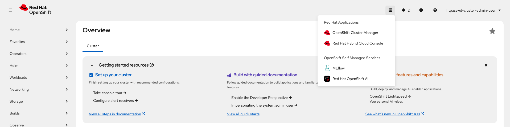
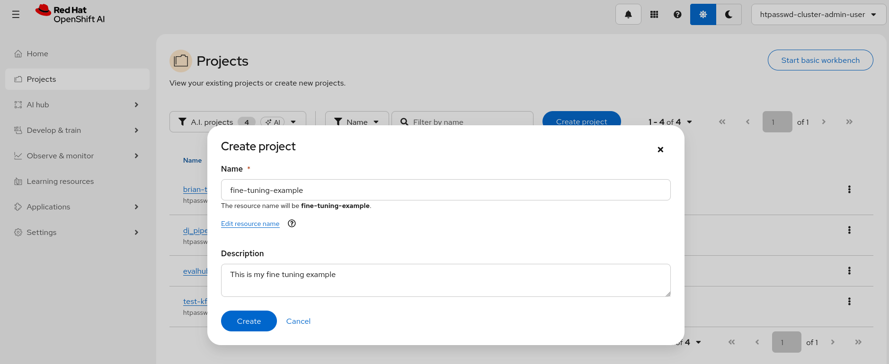
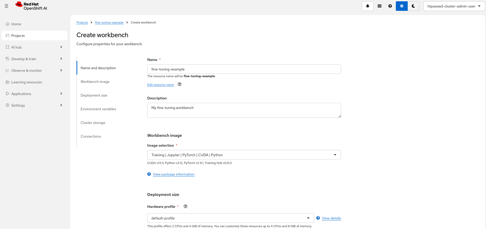
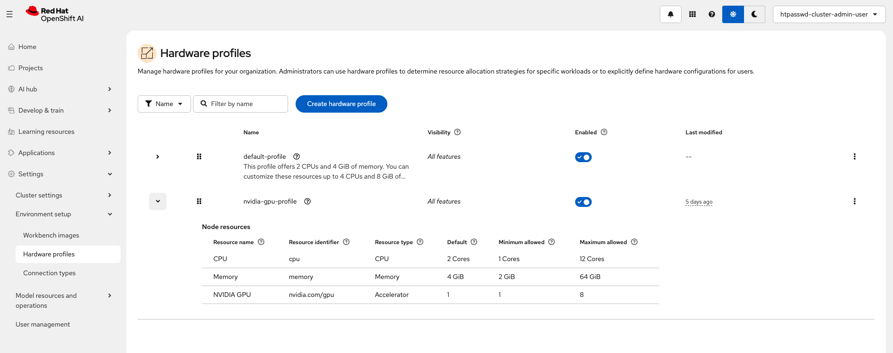
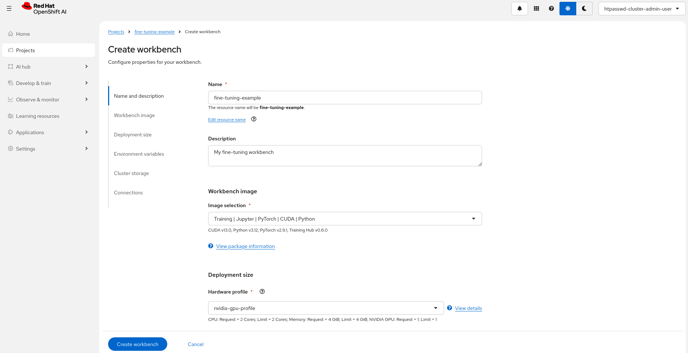
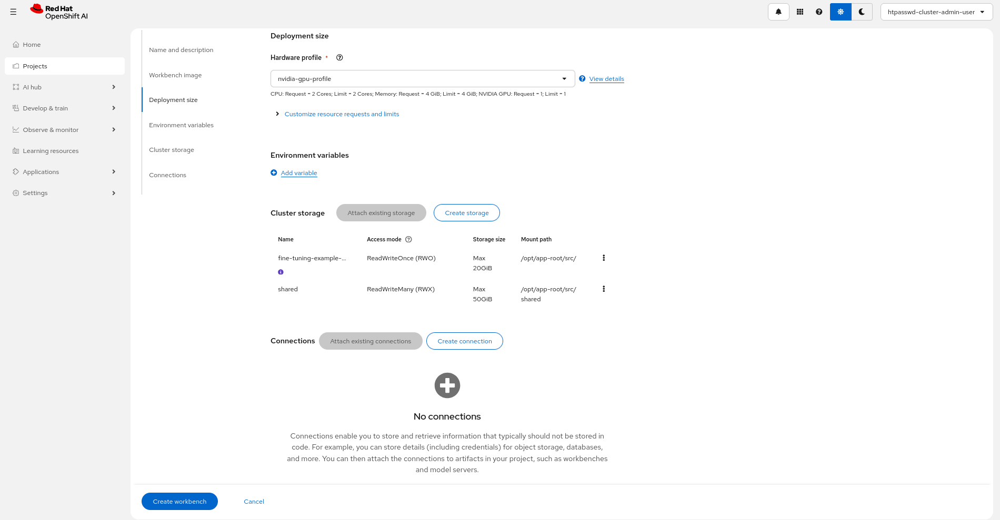
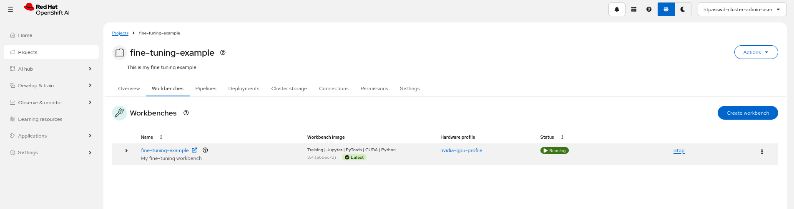

# LoRA/QLoRA Fine-Tuning with Training Hub

This example provides an overview of Training Hub's [LoRA (Low-Rank Adaptation)](https://github.com/Red-Hat-AI-Innovation-Team/training_hub?tab=readme-ov-file#lora) capabilities and demonstrates how to use them with Red Hat OpenShift AI.

## What is LoRA?

LoRA (Low-Rank Adaptation) is a parameter-efficient fine-tuning technique that:

- Freezes the pre-trained model weights
- Injects trainable low-rank matrices into each layer
- Reduces trainable parameters by ~10,000x compared to full fine-tuning
- Enables fine-tuning large models on consumer GPUs

**QLoRA** extends LoRA by adding 4-bit quantization, further reducing memory requirements while maintaining quality.

### Training Task: Natural Language to SQL

The example trains the model to understand database schemas and generate SQL queries from natural language questions. For example:

**Input:**

```text
Table: employees (id, name, department, salary)
Question: What is the average salary in the engineering department?
```

**Output:**

```sql
SELECT AVG(salary) FROM employees WHERE department = 'engineering'
```

## Execution modes

LoRA/QLoRA supports two execution modes:

- **Interactive (single node fine tuning)**: training runs directly in a workbench on a single pod, demonstrated by `lora_sft-interactive-notebook.ipynb`.
- **Distributed (distributed fine tuning with Kubeflow Trainer)**: training runs as distributed jobs across multiple nodes/pods via Kubeflow Trainer, demonstrated by `lora_sft-distributed.ipynb`.

While workbench setup is similar for both, we highlight specific configuration differences below.

To learn more about these execution modes, see the [fine-tuning execution modes overview](../README.md#execution-modes).

## RHOAI compatibility

This example is compatible with RHOAI version 3.4. For a version compatible with RHOAI 3.3 see [this README](../rhoai-3.3/lora/README.md).

## Requirements

- An OpenShift cluster with OpenShift AI (RHOAI 3.4) installed:
  - The `dashboard` and `workbenches` components enabled
  - The `trainer` component should be enabled if running the distributed notebook.
- Sufficient worker nodes with NVIDIA GPUs (Ampere-based or newer recommended).
- (Distributed only) A dynamic storage provisioner supporting RWX PVC provisioning. Talk to your cluster administrator about RWX storage options.

## Hardware requirements

For the workbench image, the example was run on `Training | Jupyter | PyTorch | CUDA | Python` and `Training | Jupyter | PyTorch | CPU Python`.
This is a single image serving both as training runtime and jupyter notebook and comes with pre-installed dependencies required
to seamlessly run fine-tuning jobs.

### Workbench Requirements (Interactive example)

| Image Type | Use Case | GPU | CPU | Memory | Notes |
|------------|----------|-----|-----|--------|-------|
| Training \| Jupyter \| PyTorch \| CUDA \| Python | NVIDIA GPU training | 2× NVIDIA L40/L40S or equivalent | 4 cores | 32Gi | Recommended for faster training |

> [!NOTE]
>
> - **Interactive (single node fine tuning)** is recommended for smaller training jobs.
> - For larger training jobs, consider the **distributed (distributed fine tuning with Kubeflow Trainer)** approach.

### Training Job Requirements (Distributed example)

| Component | Configuration | GPU per node | Total GPU | GPU Type (per GPU) | CPU | Memory |
|-----------|--------------|---|---|------------|-----|--------|
| Training Pods | 2 nodes × 2 GPUs | 2 | 4 | NVIDIA L40/L40S or equivalent | 4 cores/pod | 32Gi/pod |

> [!NOTE]
>
> - This example was tested on 2 nodes × 2 GPUs provided by L40S however, it will work on smaller/larger configurations.
> - CPU and Memory requirements scale with batch size and model size. Above suit the example as it is.
> - Worker pods are configurable from the `client.create_job` call within the notebook.

### Workbench Requirements (Distributed example)

| Image Type | Use Case | GPU | CPU | Memory | Notes |
|------------|----------|-----|-----|--------|-------|
| Training \| Jupyter \| PyTorch \| CPU Python | CPU-based evaluation | None | 6 cores | 24Gi | Slower evaluation |
| Training \| Jupyter \| PyTorch \| CUDA \| Python | NVIDIA GPU evaluation (Example Default) | 1× GPU | 2 cores | 8Gi | Recommended for faster testing |

> [!NOTE]
>
> - Workbench GPU is optional for distributed mode but recommended for faster model evaluation and required for interactive mode.
> - Evaluation was performed on L40S GPU however, it will work on smaller/larger configurations.
> - Workbench resources and accelerator are configurable in `Create Workbench` view on RHOAI Platform.

### Storage Requirements (Distributed example)

| Purpose | Size | Access Mode | Storage Class | Notes |
|---------|------|-------------|---------------|-------|
| Shared Storage (PVC) total | 50Gi (Example Default) | RWX | Dynamic provisioner required | Shared between workbench and training pods |

> [!NOTE]
>
> - Storage can be created in `Create Workbench` view on RHOAI Platform, however, dynamic RWX provisioner is required to be configured prior to creating shared file storage in RHOAI.
> - Shared storage is not required for the interactive example as dataset, model download and training all happen on the same pod.

## Setup

### Setup Workbench

**Step 1.** Access the OpenShift AI dashboard, for example from the top navigation bar menu:



**Step 2.** Log in, then go to **_Data Science Projects_** and create a project:



**Step 3.** Once the project is created, click on **_Create a workbench_**:


**Step 4.** Select the appropriate Workbench image based on interactive or distributed use case. See options above:



**Step 5.** You may want to create a **Hardware Profile** with GPU support, similar to the one below:



**Step 6.** Select the Hardware profile you want to use:



> [!NOTE]
> Adding an accelerator (GPU) for the distributed use case is only needed to test the fine-tuned model from within the workbench so you can spare an accelerator if you plan to skip that step. An accelerator (GPU) is required in interactive mode as the training happens on the workbench pod.

**Step 7.** For distributed training, create **shared storage** that'll be shared between the workbench and the training pods. Make sure it uses a storage class with RWX capability:


> [!NOTE]
> For the interactive example, dataset, model download, and training all happen on the same pod, so shared storage is not required.
> You can attach an existing shared storage if you already have one instead.

**Step 8.** Review the storage configuration and click "Create workbench":



**Step 9.** From "Workbenches" page, click on **_Open_** when the workbench you've just created becomes ready:



> [!IMPORTANT]
>
> - By default:
>   - The distributed example goes through training on two nodes (2×L40/L40S) with two GPUs each (2×48GB). However, it can be tweaked to run on smaller configurations.
>   - If you want to do model evaluation as part of the distributed example, ideally an accelerator is attached to the workbench.
>   - For the interactive example an accelerator is required for the workbench to execute the fine tuning with LoRA.

### Running the example notebooks

- From the workbench, clone this repository: `https://github.com/red-hat-data-services/red-hat-ai-examples.git`
- Navigate to the `examples/fine-tuning/lora` directory and open the [`lora_sft-interactive-notebook.ipynb`](./lora_sft-interactive-notebook.ipynb) notebook or [`lora_sft-distributed.ipynb`](./lora_sft-distributed.ipynb) as required.

> [!NOTE]
>
> - You will need a Hugging Face token if using gated models (e.g., Llama models).
>   Set the `HF_TOKEN` environment variable in your job configuration.
>   You can skip the token if switching to non-gated models.

You can now proceed with the instructions from the notebook. Enjoy!
