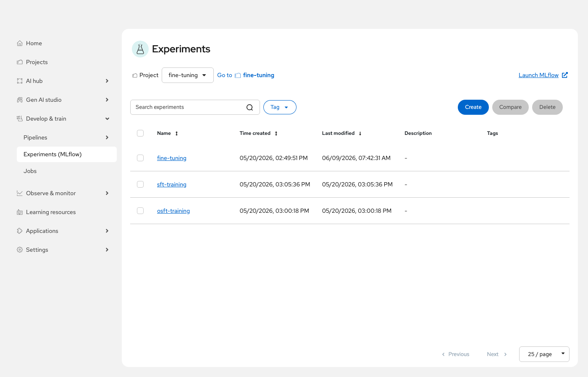
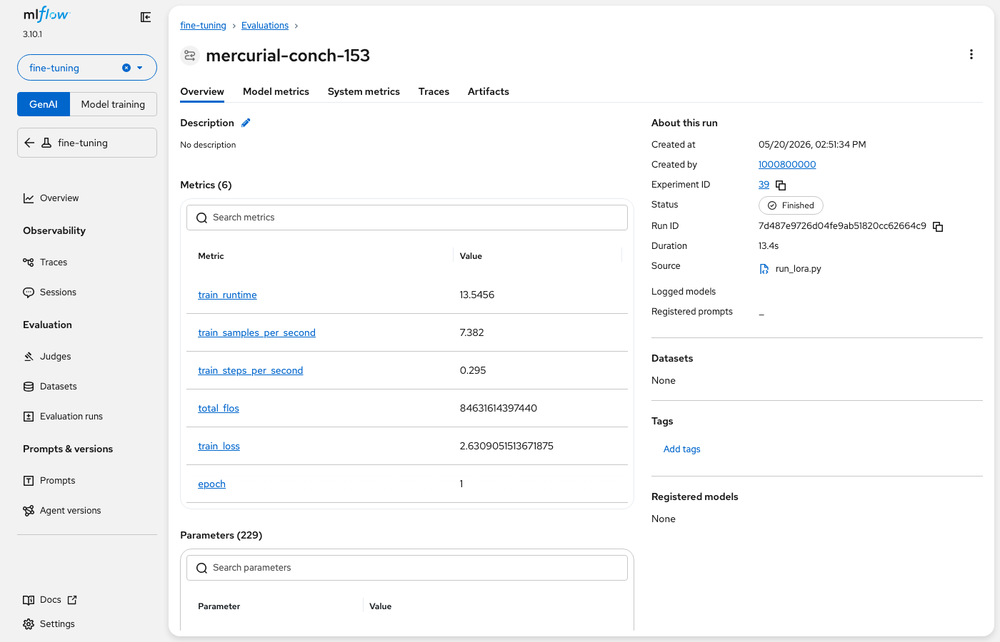

# MLflow Integration (Optional)

Training Hub supports [MLflow](https://mlflow.org/) for experiment tracking. When MLflow is enabled on your RHOAI cluster, training metrics (loss, learning rate, etc.) are automatically logged to MLflow experiments — no additional code changes required beyond setting the experiment name.

> [!NOTE]
> MLflow integration is available for **interactive (single node)** notebooks only. Distributed training jobs do not currently support MLflow tracking.

## Enabling MLflow

Each interactive notebook already includes a cell that sets the MLflow experiment name:

```python
os.environ["MLFLOW_EXPERIMENT_NAME"] = "<your-experiment-name>"
```

For this to work, MLflow must be enabled as a component in your RHOAI installation. If MLflow is not enabled, the environment variable is simply ignored and training proceeds normally.

**To enable MLflow on your cluster:**

1. Enable the MLflow Operator component in your `DataScienceCluster` CR:

   ```bash
   oc patch datasciencecluster default-dsc \
     --type=merge \
     -p '{"spec":{"components":{"mlflowoperator":{"managementState":"Managed"}}}}'
   ```

2. Create an `MLflow` CR to deploy the tracking server (example using SQLite and a PV for storage):

   ```bash
   oc apply -f - <<EOF
   apiVersion: mlflow.opendatahub.io/v1
   kind: MLflow
   metadata:
     name: mlflow
   spec:
     backendStoreUri: "sqlite:////mlflow/mlflow.db"
     defaultArtifactRoot: "file:///mlflow/artifacts"
     serveArtifacts: true
     storage:
       accessModes:
         - ReadWriteOnce
       resources:
         requests:
           storage: 10Gi
   EOF
   ```

For full details, see the [Configuring MLflow in OpenShift AI](https://access.redhat.com/articles/7136121) Knowledgebase article (requires Red Hat Customer Portal login).

## Viewing MLflow Experiments

Once training completes with MLflow enabled, you can browse your experiment runs:

1. In the OpenShift AI dashboard, navigate to **Develop & train → Experiments** from the left sidebar menu.
2. Select the experiment name to view all runs.
3. Each run contains logged metrics (training loss, learning rate), parameters, and artifacts.

You can also launch the full MLflow UI by clicking the **"Launch MLflow"** link in the top right of the Experiments page:



Each run logs metrics including training loss, learning rate, samples per second, and more:


