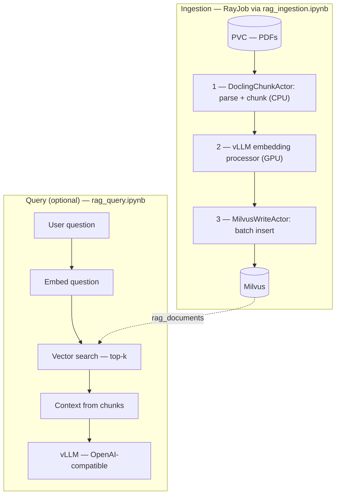

# RAG Ingestion with Ray Data, Docling, and Milvus

Build a distributed RAG ingestion pipeline on Red Hat OpenShift AI.
Parse PDFs with Docling, generate embeddings, and store vectors in Milvus —
all running as a RayJob on a RayCluster created programmatically from the notebook.

## Quick Links

| Section                             | Description                                 |
| ----------------------------------- | ------------------------------------------- |
| [Embedding Modes](#embedding-modes) | Local (CPU) vs Service (GPU) embedding      |
| [Prerequisites](#prerequisites)     | Versioned requirements and cluster setup    |
| [Runtime Image](#runtime-image)     | Pre-built image (default) or build your own |
| [Setup](#setup)                     | Validation, data download, cluster creation |
| [Configuration](#configuration)     | Required vs optional parameters             |
| [Usage](#usage)                     | Running ingestion and query notebooks       |
| [Troubleshooting](#troubleshooting) | Common issues and fixes                     |

## Overview

This example demonstrates a production-style RAG ingestion workflow using
Ray Data's streaming execution engine. Three pipeline stages run in parallel
on a RayCluster, processing PDFs end-to-end from raw files to searchable
vector embeddings in Milvus.

Key technologies: **Ray Data**, **Docling** (PDF parsing + chunking),
**sentence-transformers** or **vLLM** (embedding), **Milvus** (vector database),
**CodeFlare SDK** (RayCluster creation + RayJob submission).

## Embedding Modes

This pipeline supports **two modes** for generating embeddings:

|                 | Mode 1: Local                                   | Mode 2: Service                        |
| --------------- | ----------------------------------------------- | -------------------------------------- |
| **Setting**     | `EMBEDDING_MODE = "local"`                      | `EMBEDDING_MODE = "service"` (default) |
| **Library**     | `sentence-transformers`                         | vLLM via `vLLMEngineProcessorConfig`   |
| **Hardware**    | CPU only                                        | GPU required                           |
| **Setup**       | Simpler — no GPU workers needed                 | Requires GPU worker pool in RayCluster |
| **Throughput**  | Lower — suitable for testing and small datasets | Higher — production workloads          |
| **When to use** | Testing, no GPU available, small datasets       | Production, large-scale ingestion      |

Toggle between modes by setting `EMBEDDING_MODE = "local"` or `"service"` in the
ingestion notebook's Configure cell.

## Architecture



Ray Data **streams** the three ingestion stages so they overlap — Docling
(the slowest) does not block embedding from starting on completed chunks.

## Prerequisites

| Component | Minimum Version    | Notes                                                            |
| --------- | ------------------ | ---------------------------------------------------------------- |
| OpenShift | 4.14+              | Cluster-admin or namespace-admin access                          |
| RHOAI     | 3.x                | Red Hat OpenShift AI operator installed                          |
| KubeRay   | Bundled with RHOAI | RayCluster CRD must be available                                 |
| Milvus    | >= 2.4             | Deployed and reachable from pipeline namespace                   |
| Ray       | >= 2.54            | Included in the runtime image used by the RayCluster             |
| Python    | >= 3.11            | Workbench runtime (ships as 3.12 in the default workbench image) |

### RBAC Permissions

Your user or service account needs the following permissions in the pipeline namespace:

- `create`, `get`, `patch` on `rayclusters.ray.io` — to create and configure the RayCluster
- `create` on `rayjobs.ray.io` — to submit the ingestion pipeline
- `get` on `rayjobs.ray.io` — to monitor job status
- `get` on `pods/log` — to stream pipeline logs from the notebook

If you don't have these permissions, contact your cluster administrator. See the [RHOAI documentation](https://docs.redhat.com/en/documentation/red_hat_openshift_ai_self-managed/3.4/html/managing_openshift_ai/managing-users-and-groups#overview-of-user-types-and-permissions_managing-rhoai) for details on configuring RBAC.

### Milvus Verification

Before running the pipeline, verify Milvus is reachable from your namespace:

```bash
# Port-forward to Milvus and check health
oc port-forward svc/milvus-milvus -n milvus 19530:19530 &
curl -sf http://localhost:19530/v1/vector/collections && echo "Milvus is healthy"

# Or check from within the cluster
oc exec -n milvus deployment/milvus-milvus-proxy -- curl -sf http://localhost:19530/v1/vector/collections
```

If Milvus is not deployed, see the [Milvus Operator installation guide](https://milvus.io/docs/install_cluster-milvusoperator.md).

### Cluster

- **Red Hat OpenShift AI** with the **KubeRay operator** installed
- A **RayCluster** with CPU and GPU workers (created via `codeflare-sdk` in the notebook)
- **Milvus** accessible from the Ray cluster (standalone or operator-managed)

> [!NOTE]
> If Milvus runs in a different namespace from the RayCluster, a
> `NetworkPolicy` (or namespace label) must allow traffic from the Ray
> namespace to the Milvus service port. Without this the pipeline will
> silently hang at the Milvus connection step.

### Storage

- A **ReadWriteMany (RWX)** PVC mounted on all Ray workers and the head node
- Input PDFs uploaded to the PVC (e.g. under `/mnt/data/input/pdfs`)

### Workbench

| Setting | Value                                 |
| ------- | ------------------------------------- |
| Image   | Minimal Python 3.12 (no GPU required) |
| Memory  | 4–8 Gi                                |
| CPU     | 2 cores                               |

The workbench only submits the RayJob — all heavy processing happens on
the RayCluster.

## Runtime Image

The pre-built image `quay.io/kryanbeane/docling:latest` includes Ray 2.54+, Docling, vLLM, and pymilvus. The notebook's **Create RayCluster** cell sets this as the `RAY_IMAGE` variable and passes it to `ClusterConfiguration` — no separate manifest or build step needed.

### Advanced: Custom Runtime Image

If you need to customize dependencies, build and push your own image. A ready-to-build Dockerfile is available in the
[distributed-workloads](https://github.com/opendatahub-io/distributed-workloads/tree/main/images/runtime/examples/ray-data-rag)
repository:

```bash
cd images/runtime/examples/ray-data-rag
podman build -t quay.io/<you>/ray-data-rag:latest -f Dockerfile .
podman push quay.io/<you>/ray-data-rag:latest
```

Then update the `RAY_IMAGE` variable in the notebook's **Create RayCluster**
cell to point to your pushed image.

## Hardware Requirements

| Resource        | Specification                        |
| --------------- | ------------------------------------ |
| **GPU**         | 1× NVIDIA T4 (16 GB) or A10G (24 GB) |
| **CPU workers** | 8 nodes × 4 CPUs × 16 Gi memory      |
| **Head node**   | 2 CPUs, 10 Gi memory                 |
| **Storage**     | 50 Gi RWX PVC                        |
| **Milvus**      | Standalone or operator-managed       |

> [!NOTE]
> The notebook's **Create RayCluster** cell is sized for 8 CPU workers +
> 1 GPU worker. Scale worker counts by editing the `ClusterConfiguration`
> and patch parameters, and adjusting `NUM_ACTORS` / `CPUS_PER_ACTOR` to match.

## Files

| File                        | Description                                                    |
| --------------------------- | -------------------------------------------------------------- |
| `rag_ingestion.ipynb`       | Main notebook — configure, review pipeline, submit RayJob      |
| `docling_milvus_process.py` | RayJob entrypoint (3-stage Ray Data pipeline)                  |
| `rag_query.ipynb`           | Query notebook — deploys LLM, compares without-RAG vs with-RAG |
| `rag_helpers.py`            | Query-side helpers (keeps notebook cells short)                |
| `example.yaml`              | Example metadata (repo convention)                             |

## Setup

### Validate Prerequisites

The notebook includes a **Validate Prerequisites** cell that checks
authentication, namespace, KubeRay CRDs, and RBAC permissions using `oc`
commands. Run it after configuring your namespace.

1. **Runtime image (optional).** The default image is `quay.io/kryanbeane/docling:latest` (set via `RAY_IMAGE` in the notebook's **Create RayCluster** cell). Build and push a custom image only if you need a different dependency set — see [Advanced: Custom Runtime Image](#advanced-custom-runtime-image).
2. **Upload PDFs** to the RWX PVC. The notebook includes an optional
   **Download Sample PDFs** cell that fetches the full
   [Open RAG Benchmark](https://huggingface.co/datasets/deepmatics/open_ragbench)
   dataset (1000 arXiv PDFs, ~743 MB). Set `NUM_FILES` in the notebook to
   limit how many PDFs to process (0 = all).
3. **Create the RayCluster.** The notebook's **Create RayCluster** cell
   uses `codeflare-sdk` to create a RayCluster with 8 CPU workers, then
   patches it with `oc patch` to add a GPU worker group, mount the PVC on
   all nodes, and tune `rayStartParams`. No separate YAML manifest is needed.

## Usage

1. **Open `rag_ingestion.ipynb`** in your RHOAI workbench and run cells top-to-bottom:

   - Authenticate (`oc login`)
   - Configure cluster, PVC, Milvus, and embedding settings
   - (Optional) Validate prerequisites and download sample PDFs
   - Create the RayCluster via `codeflare-sdk` and patch it with GPU workers + PVC mounts
   - Review the pipeline overview
   - Submit the RayJob
   - Monitor status (polling loop) and fetch logs

2. **Verify** the Milvus collection is populated (row count is printed in
   the job logs performance report and in the notebook's Verify cell).

3. **(Optional)** Open `rag_query.ipynb` to test retrieval quality — compare
   LLM answers without RAG vs with RAG.

### Deploy Query LLM

The query notebook (`rag_query.ipynb`) deploys `ibm-granite/granite-3.1-8b-instruct`
automatically via KServe. The model is pulled from Hugging Face at serve time —
no PVC, token, or pre-download required.

## Expected Outcomes

After a successful ingestion run you should see:

- **Performance report** in the RayJob logs showing documents processed,
total chunks, wall-clock time, throughput (chunks/sec, docs/sec), and
per-stage timing breakdown (Docling parse, chunking, embedding, Milvus write).
- **Milvus row count** matching the total chunks reported — e.g. ~120,000
vectors for 1000 PDFs at `CHUNK_MAX_TOKENS=256`.
- **`rag_query.ipynb`** returns cited answers from the ingested papers when
queried with RAG, compared to generic/incorrect answers without RAG.

Note: Each pipeline run drops and recreates the Milvus collection by default. Set `DROP_EXISTING_COLLECTION=false` to prevent accidental drops — the job will abort if the collection already exists (see [Collection Management](#collection-management)).

Typical performance on the reference hardware (8 CPU workers + 1 T4 GPU):

| Workload  | Wall clock | Throughput     |
| --------- | ---------- | -------------- |
| 50 PDFs   | ~8 minutes | ~21 chunks/sec |
| 1000 PDFs | ~2.5 hours | ~21 chunks/sec |

## Configuration

All parameters are environment variables set in the ingestion notebook.

### Collection Management

> ⚠️ **Warning:** By default, the pipeline **drops and recreates** the Milvus collection on every run, destroying all existing data.

Set `DROP_EXISTING_COLLECTION = "false"` in the notebook's Configure cell to fail gracefully if the collection already exists. This is recommended after your initial test run to prevent accidental data loss.

### Embedding Parameters

| Parameter              | Default                                      | Description                                                       |
| ---------------------- | -------------------------------------------- | ----------------------------------------------------------------- |
| `EMBEDDING_MODE`       | `service`                                    | `"local"` (sentence-transformers, CPU) or `"service"` (vLLM, GPU) |
| `EMBEDDING_MODEL`      | `ibm-granite/granite-embedding-125m-english` | Model used for embedding (both modes)                             |
| `EMBEDDING_DIM`        | 768                                          | Vector dimension (must match model)                               |
| `EMBEDDING_BATCH_SIZE` | 32                                           | Rows per actor call in local embedding mode                       |
| `NUM_EMBEDDING_ACTORS` | 2                                            | CPU actors for local mode                                         |

### Service Mode Parameters (vLLM)

Only used when `EMBEDDING_MODE = "service"`:

| Parameter                 | Default                     | Description                                                               |
| ------------------------- | --------------------------- | ------------------------------------------------------------------------- |
| `VLLM_MODEL_SOURCE`       | (same as `EMBEDDING_MODEL`) | Embedding model for vLLM                                                  |
| `VLLM_BATCH_SIZE`         | 4                           | Batch size for vLLM processor. Reduce to 1–2 on T4 (16 GB) if OOM occurs. |
| `VLLM_CONCURRENCY`        | 1                           | GPU workers for embedding                                                 |
| `VLLM_ENGINE_KWARGS_JSON` | `{"enforce_eager":true,"gpu_memory_utilization":0.8}` | vLLM engine args (JSON); tune for your GPU |

### Pipeline Parameters

| Parameter            | Default | Description                                                                                                                                                                                |
| -------------------- | ------- | ------------------------------------------------------------------------------------------------------------------------------------------------------------------------------------------ |
| `NUM_ACTORS`         | 6       | Docling parsing actors (CPU-heavy). Too many actors vs total CPUs can stall streaming — see [Sizing for your hardware](#sizing-for-your-hardware).                                         |
| `CPUS_PER_ACTOR`     | 4       | CPUs per Docling actor                                                                                                                                                                     |
| `NUM_MILVUS_ACTORS`  | 2       | Milvus write actors (I/O-bound)                                                                                                                                                            |
| `NUM_FILES`          | 0       | PDFs to process (0 = all)                                                                                                                                                                  |
| `BATCH_SIZE`         | 2       | PDFs per Docling actor batch                                                                                                                                                               |
| `REPARTITION_FACTOR` | 2       | Multiplier applied when repartitioning before embedding. Higher spreads blocks across the cluster (can smooth hotspots) but increases shuffle cost; tune with dataset size and CPU budget. |
| `CHUNK_MAX_TOKENS`   | 256     | Max tokens per chunk                                                                                                                                                                       |
| `MILVUS_BATCH_SIZE`  | 64      | Vectors per Milvus insert batch                                                                                                                                                            |

### Embedding Model Note

When using `"service"` mode for ingestion and `sentence-transformers` for querying (in `rag_query.ipynb`), both use the same model (`ibm-granite/granite-embedding-125m-english`) and produce compatible vectors, but outputs are not bit-identical due to differences in preprocessing and pooling. This works well in practice. When using `"local"` mode, both ingestion and query use `sentence-transformers` and produce identical embeddings.

### Sizing for your hardware

Ray Data runs Docling (`NUM_ACTORS` CPU actors), vLLM on GPU, and Milvus writers at the same time. **Actor-based CPU stages are sensitive to how much of the cluster you reserve for Docling:** if those actors claim too large a share of total CPUs, the streaming executor can stall waiting for capacity — often mistaken for a deadlock unless you leave enough headroom for Ray, Milvus actors, GPU-worker CPUs, and the head node.

**70% rule:** Aim to use at most about **70%** of **total cluster CPUs** for Docling (`NUM_ACTORS × CPUS_PER_ACTOR`), and leave roughly **30%** for scheduling, Milvus write actors, GPU-worker CPUs, object store, and other overhead.

Use this as a **starting point** for `NUM_ACTORS`:

```text
max_actors = floor(total_cluster_cpus × 0.70 / CPUS_PER_ACTOR)
```

**Local embedding mode:** When `EMBEDDING_MODE = "local"`, each sentence-transformers embedding actor also reserves 2 CPUs. Subtract `NUM_EMBEDDING_ACTORS × 2` from the 70% CPU budget before dividing by `CPUS_PER_ACTOR`. In service mode this doesn't apply — embedding runs on GPU workers and doesn't compete for CPU headroom.

Example clusters with `CPUS_PER_ACTOR = 4` (total CPUs include worker pools plus typical head/GPU-worker CPU contributions as in the table labels):

| Cluster                                       | Total CPUs | 70% CPU budget | max NUM_ACTORS (formula) |
| --------------------------------------------- | ---------- | -------------- | ------------------------ |
| Small (4 workers × 4 CPU + head 2 CPU)        | 18         | 12             | 3                        |
| Reference (8 workers × 4 CPU + 1 GPU × 2 CPU) | 34         | 23             | 5                        |
| Large (16 workers × 4 CPU + 2 GPU × 2 CPU)    | 68         | 47             | 11                       |

On the **reference** cluster, the formula gives **5** actors (conservative). This example’s **default `NUM_ACTORS` of 6** was tested on that hardware and uses slightly more than the nominal 70% Docling share (~71% of cluster CPUs for Docling alone). Treat the formula as a safe baseline when porting to a new cluster; raise `NUM_ACTORS` gradually while watching Ray Dashboard CPU utilization and job progress.

Also align **`REPARTITION_FACTOR`** with how much parallelism you want between Docling and embedding: higher factors create more blocks (and more shuffle) relative to Docling output — useful on larger clusters if stages otherwise bottleneck on partition count.

### Repartition tuning

`REPARTITION_FACTOR` controls how many blocks each actor's output is split
into before the embedding stage (`target_blocks = NUM_ACTORS × REPARTITION_FACTOR`).

- **When it helps:** Few large input blocks where each PDF produces many chunks.
Repartitioning spreads work evenly across embedding and Milvus-write stages.
- **When it hurts:** The default workload is already well-distributed (many
small PDFs), or the cluster has limited CPU headroom. Each repartition
creates reduce tasks that compete for CPU slots; too many can trigger
deadlock on small clusters.

The default `REPARTITION_FACTOR=2` produces `6 × 2 = 12` blocks, which
schedules comfortably on the reference hardware's ~10-CPU headroom.

## Observability

### Dashboard access

**Primary (CodeFlare SDK):** After connecting to the cluster in the notebook,
the dashboard URL is available via:

```python
print(cluster.cluster_dashboard_uri())
```

This resolves automatically via HTTPRoute (RHOAI v3.0+), OpenShift Route,
or Ingress depending on the platform.

**Fallback (port-forward):** For non-RHOAI environments or manual access:

```bash
oc port-forward svc/<cluster-name>-head-svc 8265:8265 -n <namespace>
# Open http://localhost:8265
```

Useful views while the job runs:

- **Jobs** — submission status, logs, duration
- **Actors** — live DoclingChunkActor / MilvusWriteActor instances and their state
- **Metrics** — CPU, GPU, and object store utilization across workers

## Troubleshooting

### RayJob not starting

```bash
oc get rayjob <job-name> -n <namespace> -o yaml
oc get pods -l ray.io/cluster=<cluster-name> -n <namespace>
```

### PVC access errors

Verify the PVC has `ReadWriteMany` access mode:

```bash
oc get pvc <pvc-name> -n <namespace> -o jsonpath='{.spec.accessModes}'
```

### Milvus connection refused

Check that the Milvus service is reachable from the Ray cluster:

```bash
oc exec -it <head-pod> -n <namespace> -- curl -s http://<milvus-host>:<port>/v1/vector/collections
```

### vLLM GPU out-of-memory

On smaller GPUs (e.g. Tesla T4, 16 GB), CUDA graph capture can exhaust VRAM.
Set `VLLM_ENGINE_KWARGS_JSON={"enforce_eager": true, "gpu_memory_utilization": 0.8}`
in the ingestion notebook to disable graph capture and reduce memory usage.

### Actor memory errors

Reduce `NUM_ACTORS` or increase `worker_memory_limits` in the notebook's
`ClusterConfiguration`. Large/complex PDFs can require 2–4 Gi per Docling actor.

### CodeFlare SDK secret size exceeded

If the RayJob submission fails with "Secret size exceeds 1MB limit", ensure
the notebook's `working_dir` points to a minimal directory containing only
`docling_milvus_process.py` (the notebook handles this automatically).

### Pipeline stuck with no errors

If the pipeline appears hung with no error messages, check for resource deadlock
or backpressure using the Ray tasks API:

```bash
# Get task states from the Ray head node
oc exec -it <head-pod> -n <namespace> -- \
  curl -s http://localhost:8265/api/v0/tasks | python3 -m json.tool
```

Look for:

- `PENDING_NODE_ASSIGNMENT` — tasks cannot be scheduled because all CPUs are
reserved by running actors. Reduce `NUM_ACTORS` (see "Sizing for your hardware").
- `backpressured:tasks(ResourceBudget)` — Ray Data is throttling new tasks
because downstream stages are slower than upstream. This is normal behavior but
if throughput is near zero, reduce `REPARTITION_FACTOR` to lower the number of
concurrent reduce tasks competing for CPU headroom.

With the default configuration (`NUM_ACTORS=6`, `REPARTITION_FACTOR=2`), the
reference hardware (34 CPUs) has ~10 CPUs of headroom for scheduling overhead,
MilvusWriteActors, repartition reduce tasks, and Ray Data executor.

## Related examples

- **[Distributed PDF Processing with Docling](../../docling/)** — batch
PDF-to-JSON/Markdown conversion without the RAG stack
- [RAG Pipeline with KFP](../../../rag/) — A complementary approach using Kubeflow Pipelines for multi-step RAG ingestion.
